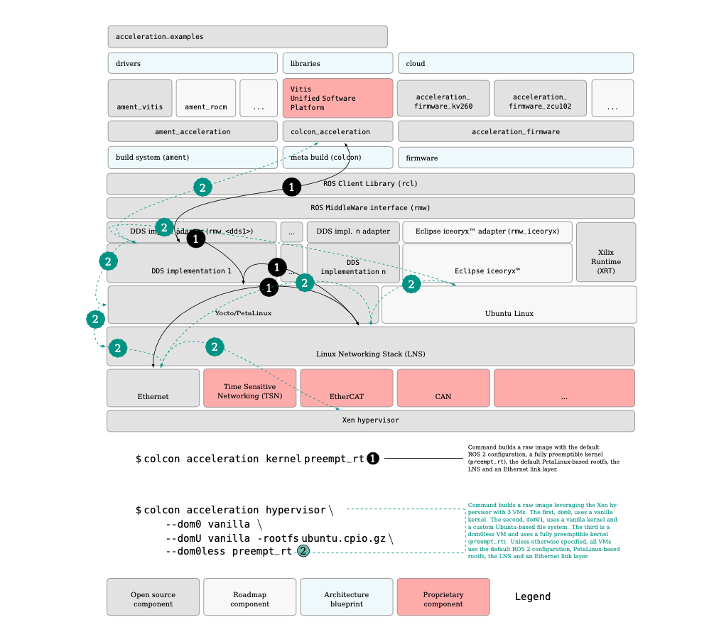

# Real-time ROS 2


```eval_rst
Real-time is an end-to-end characteristic of a robotic system. A ROS 2 application running in a scalar processor (i.e. a CPU) suffers from different sources of indeterminism. The picture above depicts these across the OSI stack. For a robot to respond in a deterministic manner while exchanging information inter-process, intra-process or intra-network while using ROS 2, all layers involved across the OSI stack must respond deterministically. It's not possible to guarantee real-time in ROS 2 unless all overlayers [1]_  (not to be mistaken with overlays workspaces [3]_ ) and underlayers [2]_ are equally time bounded. Correspondingly, **for a real-time ROS 2 interaction, all of its layers must also be real-time**. In the case of ROS 2 running in CPUs, for each one of these levels, the sources of indeterminism need to be addressed.
```

<!-- Footnotes -->


FPGAs allow to design robot circuitry that provides deterministic responses. It is possible to design hard real-time robotic systems relying solely on the FPGA, however, when interfacing with ROS 2 often running on the scalar processors (CPUs), the determinism is often compromised. The goal of KRS is to provide mechanisms to mitigate all these indeterminism issues in the scalar processors through a modular approach. Customers can then prioritize and use selected modules to remove the desired sources of indeterminism, adapting time mitigations to each use case. 

In general, solutions to real-time problems in CPUs fall into two big categories: a) setting the correct priority in the corresponding abstraction and b) applying Quality of Service (QoS) techniques. Each layer has its own QoS methods. In OSI Layer 2 we have the well-known QoS techniques specified in the existing IEEE 802.1Q standards, and new techniques such as the Time Sensitive Networking (TSN) standards. For the Linux Network Stack (OSI Layers 3 and 4), traffic control allows to configure QoS methods. Similarly, from the Linux kernel all the way up to the application libraries, each layer needs to be configured for bounded maximum latencies in order for the robotic system to deliver real-time capabilities. The sections below analyze briefly the indeterminism sources one by one and provide a short discussion around the solutions integrated within KRS:

<style>
table th:first-of-type {
    width: 5%;
}
table th:nth-of-type(2) {
    width: 95%;
}

.wy-table-responsive table td,
.wy-table-responsive table th {
    white-space: normal;
}
</style>

|   |    |
|---|----|
| ①  | **Link layer congestion bottlenecks**:  real-time problems related to Data Link layer bottlenecks (OSI L2) are a relevant source of indeterminism in distributed robotic systems. The most common scenario is when different traffic sources are present in the same network segment with different orders of priority. For example,  congestion problems may arise when various depth sensors generating point clouds of the environment are transmitted over switched Ethernet networks, mixed together with higher priority traffic (e.g. that commands actuators). This may lead to undesired indeterminism or even to packet drops for time critical packages. KRS addresses these problems by providing time sensitive link-layer components such as TSN, which enables deterministic real-time communications over Ethernet. Another source of indeterminism in the Data Link layer comes while interoperating between different communication buses. For example, relaying the sensing data perceived over Ethernet to an EtherCAT fieldbus, or passing annotated data from Ethernet to CAN. The interfacing between these networks in scalar processors typically happens at higher layers (e.g. OSI L7) which besides consuming many additional processing cycles, exposes data to the additional indeterminism of upper abstraction layers. By leveraging the FPGA, KRS provides capabilities to create specialized circuitry to bridge communications between these networks while operating on the data, everything while at the Data Link layer.
| ② | **Linux Networking Stack (LNS) queues congestion**: the real-time problems in the Linux Network Stack (LNS) arise when networking resources (e.g. queues) shared between ROS 2 publishers and subscribers in the same device cause congestion issues, leading to undesired latencies. These delays become specially apparent when considering the threads processing the networking messages, which might be competing for CPU time (further enhancing the real-time issues at ③). KRS leverages the [Linux kernel Traffic Control](https://tldp.org/HOWTO/Traffic-Control-HOWTO/overview.html) (`tc`) capabilities to mitigate the indeterminism of the LNS.  |
| ③ | **Linux kernel indeterminism**: this source accounts for the real-time problems related with the indeterminism inside the Operating System (OS) or more specifically, the lack of timely preemptions at the kernel level, including its drivers. As an example, the lack of preemption capabilities in a kernel driver may leads to communication interactions that suffer delays because CPU cycles arrive late when processing, delivering or retrieving messages. KRS addresses these real-time issues by a) offering a fully preemptible Linux kernel (`PREEMPT_RT`) and b) by maintaining a Xilinx-specific Linux kernel fork with drivers optimized for determinism and preemption. |
| ④ | **Last level cache (LLC) contention**: Another large source of real-time interference in multi-core scalar processors is the last level cache. In a multi-core CPUs, the last level cache (LLC) is shared by all cores and means that a noisy neighbor can have a drastic impact on the worst-case execution time (WCET) of software on other cores. Past research showed a slowdown factor of 340 times, swamping the theoretical 4 times speedup expected from a quad core multi-core processor. KRS addresses this problem by cache coloring at the Xen hypervisor level. Cache coloring consists of partitioning the L2 cache, allocating a cache entry for each Virtual Machine (VM) in the hypervisor. This approach allows real-time applications to run deterministic IRQs, lowering the time variance, reducing the effects of cache interference and allowing mixed critical workloads on a single SoC.
| ⑤  | **Communication middleware indeterminism**: Often architected and programmed with a data connectivity and throughput mindset (as opposed to determinism), the communication middleware also represents a source of indeterminism. Real-time safe coding practices should be applied when implementing the communication middleware, and also when used in higher abstraction layers. In addition, it should also be considered that the communication middleware builds on top of L1-L4 of the OSI stack, which forces the middleware implementations to rely on deterministic lower layers for overall end-to-end real-time capabilities. KRS currently provides support for the  most popular communication middlewares in the ROS 2 world. Future enhancements are planned to make these implementations rely on real-time deterministic lower layers. |
| ⑥ | **ROS 2 core layers indeterminism**: Similar to ④, the ROS 2 layers should be built using real-time safe primitives and real-time capable underlayers. KRS initially supports the official ROS 2 `rclcpp`, `rcl`, `rmw`, and `rmw_adapters`. Ongoing work is in progress to  explore other architectures which push some of the ROS 2 abstractions to hardware. |
| ⑦ | **Robotic applications and libraries indeterminism**: Finally, at the application level, the robotics code including all its libraries also need to be real-time safe and use only the underlying primitives and layers that guarantee determinism. |

In addition to mitigations for these problems, KRS also packs capabilities to facilitate creating systems for mixed criticality. The following figure shows two examples of how KRS extends `colcon` (through `colcon_acceleration`) to easily ❶ select a fully preemptible Linux kernel and ❷ a mixed critical setup in the same SoC involving the Xen hypervisor with three Virtual Machines (VMs). 




```eval_rst

.. [1] ROS 2 overlayers refer to any ROS 2 package built on top of the ROS 2 core layers (rcl, rmw, and the corresponding communication middleware implementation adapters). Examples of ROS 2 overlayers include the navigation stack packages, the manipulation stack, the perception stack and similarly, any of the packages within the ROS 2 `examples <https://github.com/ros2/examples/>`_ meta-package.

.. [2] ROS 2 underlayers refer to any ROS 2 package built below the ROS 2 core layers (rcl, rmw, and the corresponding communication middleware implementation adapters). The communication middleware implementation (e.g. DDS) is also considered part of the ROS 2 underlayers. Examples of ROS 2 underlayers include a DDS implementation, the networking stack, the Data Link Layer (e.g. Ethernet), etc.

.. [3] A ROS 2 workspace is the folder inside which a series of ROS packages are developed and built. Keeping things in separate spaces helps development Workspaces in ROS 2 can be overlayed, in a waterfall-like mode. An overlay workspace allows to easily extend ROS 2 software across different spaces in a way that overlays can be built on top of another overlay, and any packages in a higher overlay will mask out packages in lower overlays. *Refer to* `REP-0128 <https://www.ros.org/reps/rep-0128.html/>`_ *for more information about ROS workspaces and overlays. The concepts are framed for catkin and ROS, but equally applicable to colcon and ROS 2*.

```
