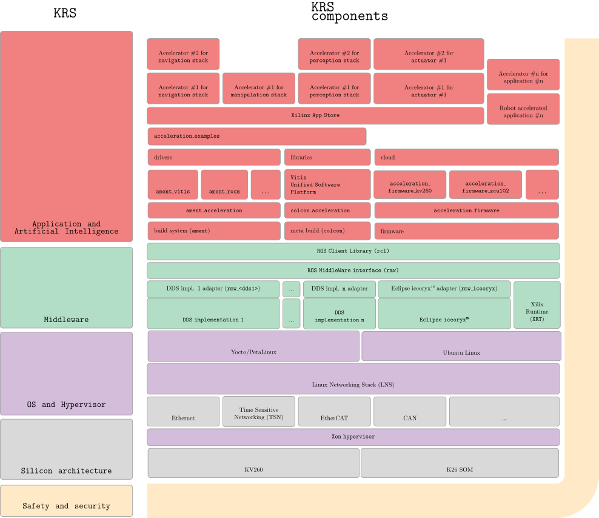

###############################################################################################################
Kria Robotics Stack (KRS)
###############################################################################################################

.. sidebar:: Before you begin
   
   KRS builds on ROS 2.

   If you're not familiar, before continuing, learn more about ROS 2 from its `official documentation <https://docs.ros.org/>`_.

The **Kria Robotics Stack (KRS)** is a ROS 2 superset for industry, an integrated set of robot libraries and utilities to accelerate the development, maintenance and commercialization of industrial-grade robotic solutions while using `adaptive computing <https://www.xilinx.com/applications/adaptive-computing.html>`_. KRS provides to ROS 2 users an easy and robust path to hardware acceleration. It allow ROS 2 roboticists to create custom secure compute architectures with higher productivity. KRS leverages Xilinx technology targeting the `Kria SOM portfolio <https://www.xilinx.com/products/som/kria.html>`_ to deliver low latency (real-fast), determinism (predictable), real-time (on-time), security and high throughput to robotics.

It does so by tightly integrating itself with ROS (lingua franca amongst roboticists) and by leveraging a combination of modern C++ and High-Level Synthesis (HLS), together with reference development boards and design architectures roboticists can use to kick-start their projects. Altogether, KRS supports Kria SOMs with an accelerated path to production in robotics.

.. admonition:: Alpha Release

    KRS is still on **alpha** release. Correspondingly, the documentation provided here is not intended for production environments and should be used only for evaluation purposes.

    *Stay tuned for upcoming official releases*.

.. toctree::
   :maxdepth: 3
   :caption: Introduction
   :hidden:

   docs/intro
   docs/install
   docs/hardware

.. toctree::
   :maxdepth: 3
   :caption: Features
   :hidden:

   docs/features/ros2centric
   docs/features/realtime_ros2
   docs/features/accelerated_apps_ros2
   docs/features/contributing_ros2

.. toctree::
   :maxdepth: 3
   :caption: Examples
   :hidden:

   docs/examples/0_ros2_publisher
   docs/examples/1_hello_xilinx
   docs/examples/2_hls_ros2
   docs/examples/3_offloading_ros2_publisher
   docs/examples/4_accelerated_ros2_publisher
   docs/examples/5_faster_ros2_publisher

.. toctree::
   :maxdepth: 3
   :caption: HowTo
   :hidden:

   docs/howto

.. toctree::
   :maxdepth: 3
   :caption: Other
   :hidden:

   docs/other/definitions

