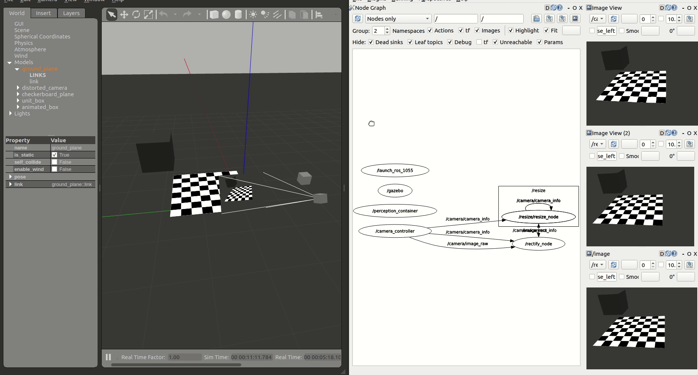

# 6. Accelerating a perception computational graph

|  Graph | Rationale | Acceleration kernel (FPGA)| Host (CPU) |
|-------------------|-----------|-------------|--------|
| Perception graph (CPU) ([launch file](https://github.com/ros-acceleration/acceleration_examples/blob/main/graphs/perception/perception_2nodes/launch/trace_rectify_resize.launch.py)) | CPU graph, **2 ROS Components** | | [`rectify.cpp`](https://github.com/ros-acceleration/image_pipeline/blob/ros2/image_proc/src/rectify.cpp), [`resize.cpp`](https://github.com/ros-acceleration/image_pipeline/blob/ros2/image_proc/src/resize.cpp)|
| Perception graph, offloaded (CPU + FPGA) ([launch file](https://github.com/ros-acceleration/acceleration_examples/blob/main/graphs/perception/perception_2nodes/launch/trace_rectify_resize_fpga.launch.py)) | FPGA-offloaded graph, using Vitis Vision Library for OpenCV operations, **2 ROS Components, 2 kernels** | [`resize_accel`](https://github.com/ros-acceleration/image_pipeline/blob/ros2/image_proc/src/image_proc/xf_resize_accel.cpp), [`rectify_accel`](https://github.com/ros-acceleration/image_pipeline/blob/ros2/image_proc/src/image_proc/xf_rectify_accel.cpp) | [`rectify_fpga.cpp`](https://github.com/ros-acceleration/image_pipeline/blob/ros2/image_proc/src/rectify_fpga.cpp), [`resize_fpga.cpp`](https://github.com/ros-acceleration/image_pipeline/blob/ros2/image_proc/src/resize_fpga.cpp) |
| Perception graph integrated (CPU + FPGA) ([launch file](https://github.com/ros-acceleration/acceleration_examples/blob/main/graphs/perception/perception_2nodes/launch/trace_rectify_resize_fpga_integrated.launch.py))| FPGA-offloaded graph, re-architected into a single Component, **1 ROS Component, 1 kernel** | [`rectify_resize_accel`](https://github.com/ros-acceleration/image_pipeline/blob/ros2/image_proc/src/image_proc/xf_rectify_resize_accel.cpp) | [`rectify_resize_fpga_integrated.cpp`](https://github.com/ros-acceleration/image_pipeline/blob/ros2/image_proc/src/rectify_resize_fpga_integrated.cpp) |
| Perception graph streamlined (CPU + FPGA) ([launch file](https://github.com/ros-acceleration/acceleration_examples/blob/main/graphs/perception/perception_2nodes/launch/trace_rectify_resize_fpga_streamlined.launch.py))  | FPGA-offloaded graph, AXI4 Stream interfaces between ROS 2 Nodes, **2 ROS Components, 2 kernels using stream interfaces**. *Note: to connect the pipeline, the second function, resize, subscribes also to the raw image topic, but doesn't use it (fetches data from accelerator).*. | [`resize_accel_streamlined`](https://github.com/ros-acceleration/image_pipeline/blob/ros2/image_proc/src/image_proc/xf_resize_accel_streamlined.cpp),  [`rectify_accel_streamlined`](https://github.com/ros-acceleration/image_pipeline/blob/ros2/image_proc/src/image_proc/xf_rectify_accel_streamlined.cpp) | [`resize_fpga_streamlined.cpp`](https://github.com/ros-acceleration/image_pipeline/blob/ros2/image_proc/src/resize_fpga_streamlined.cpp), [`rectify_fpga_streamlined.cpp`](https://github.com/ros-acceleration/image_pipeline/blob/ros2/image_proc/src/rectify_fpga_streamlined.cpp) |


```eval_rst
.. sidebar:: Before you begin
    Make sure to check out the section on `Accelerating ROS 2 Nodes <nodes.html>`_ first.    

.. important::
    The source code of the computational graph is available at `perception_2nodes <https://github.com/ros-acceleration/acceleration_examples/tree/main/graphs/perception/perception_2nodes>`_ package.

```

## The perception computational graph

In this example, we trace, benchmark, and accelerate a subset of  `image_pipeline`, one of the most popular packages in the ROS 2 ecosystem, and a core piece of the ROS perception stack. We compose a simple computational graph consisting of two nodes, *resize* and *rectify*, as shown in the figure below. We then leverage KRS for hardware acceleration to benchmark, trace and accelerate our computational graph, comparing a CPU to an FPGA implementation.


## Building the acceleration kernels

Before we provide a completely walkthrough, let's build the acceleration kernels (you can leave it running in the background since it may take more than an hour):
```bash
$ cd ~/krs_ws  # head to your KRS workspace

# prepare the environment
$ source /tools/Xilinx/Vitis/2022.1/settings64.sh  # source Xilinx tools
$ source /opt/ros/humble/setup.bash  # Sources system ROS 2 installation
$ export PATH="/usr/bin":$PATH  # FIXME: adjust path for CMake 3.5+

# build the workspace to deploy KRS components
$ colcon build --merge-install  # about 2 mins in an AMD Ryzen 5 PRO 4650G

# source the workspace as an overlay
$ source install/setup.bash

# select kv260 firmware (in case you've been experimenting with something else)
$ colcon acceleration select kv260

# build all packages up to perception_2nodes, without accelerators
$ colcon build --build-base=build-kv260 --install-base=install-kv260 --merge-install --mixin kv260 --cmake-args -DNOKERNELS=true --packages-up-to perception_2nodes image_pipeline_examples

# build image_proc package again, now with accelerators
# WARNING: this will take a considerable amount of time
$ colcon build --build-base=build-kv260 --install-base=install-kv260 --merge-install --mixin kv260  --cmake-args -DNOKERNELS=false --packages-select image_proc perception_2nodes

# copy to KV260 rootfs, e.g.
$ scp -r install-kv260/* petalinux@192.168.1.86:/ros2_ws/
```

## Acceleration of a perception computational graph, a step by step guide

```eval_rst
.. warning::
    If you wish to learn about the ROS 2 methodology for hardware acceleration, refer to `REP-2008 Pull Request <https://github.com/ros-infrastructure/rep/pull/324>`_
```

### A. Trace computational graph

The first step is to instrument and trace the ROS 2 computational with LTTng probes. Reusing [past work and probes](https://arxiv.org/abs/2201.00393) allows us to easily get a grasp of the dataflow interactions within `rmw`, `rcl` and `rclcpp` ROS 2 layers. But to trace appropriately the complete computational graph, besides these tracepoints, we also need to instrument our userland code. Particularly, as depicted for the publication path in the figure below, we need to add instrumentation to the `image_pipeline` package and more specifically, to the ROS *Components* that we're using.

| ROS 2  Layer | Trace  point | Desired transition |
|-------------|-------|-------|
|`userland` | |
| | `image_proc_rectify_init` | CPU-FPGA  |
|                                    | `image_proc_rectify_fini` | FPGA-CPU  |
|                                    | `image_proc_rectify_cb_fini` |  |
|                                    | `image_proc_resize_cb_init` |   |
|                                    | `image_proc_resize_init` | CPU-FPGA  |
|                                    | `image_proc_resize_fini` | FPGA-CPU  |
|                                    | `image_proc_resize_cb_fini` |  |
|`rclcpp` | |
| |` callback_start`             |  |
|                                  | `callback_end`               |  |
|                                  | `rclcpp_publish`             |  |
|`rcl` | |
| | `rcl_publish`                   |  |
|`rmw` | |
| | `rmw_publish`  | |

This is illustrated in the Table above and implemented at https://github.com/ros-perception/image_pipeline/pull/717, including the instrumentation of `ResizeNode` and `RectifyNode` ROS 2 *Components*. Further instrumentation could be added to these *Components* if necessary, obtaining more granularity in the tracing efforts.

Below, we depict the results obtained after instrumenting the complete ROS 2 computational graph being studied. A closer inspection shows in grey that the **ROS 2 message-passing system across abstraction layers takes a considerable portion of the CPU**. In comparison, **in light red, taking only a small portion of each Node's execution time**, we depict the computations that interact with the data flowing across nodes. Both the core logic of each one of the Nodes (*rectify* and *resize* operations) as well as the ROS 2 message-passing *plumbing* will be subject to acceleration.


### `B.` Benchmark CPU baseline


After tracing the graph and obtaining a good understanding of the dataflow, we can proceed to produce a CPU baseline benchmark while running in the Xilinx Kria® KV260 Vision AI Starter Kit quad-core Processing System (the CPU).

To generate the CPU baseline you can use the pre-cooked ROS 2 launch file which will launch both the tracing capabilities and the corresponding ROS 2 Nodes:

```eval_rst
.. warning::
    As documented in https://github.com/ros-visualization/rqt/issues/187#issuecomment-1001183947, Gazebo plugins and ROS 2 Nodes QoS configurations can often be tricky and not that well aligned historically. At the time of testing, ROS 2 Humble presents such issues. A fix is included among the packages fetched while installing the KRS workspace. If you did not yet, check out the install section and ensure that you're using a compatible version of "gazebo_ros_pkgs" package.      
```

```bash
# Launch Gazebo simulator in your workstation
#  requires Gazebo installed and GUI-capabilities
$ cd ~/krs_ws  # head to your KRS workspace
$ source /opt/ros/humble/setup.bash  # Sources system ROS 2 installation
$ colcon build --merge-install  # build the workspace to deploy KRS components
$ source install/setup.bash  # source the workspace as an overlay
$ ros2 launch perception_2nodes simulation.launch.py

# Launch the graph in the KV260 CPU (should be connected to the same local network)
$ source /opt/ros/humble/setup.bash
$ ros2 launch perception_2nodes trace_rectify_resize.launch.py
```



### `C.` Hardware acceleration

The third step in the methodology for ROS 2 hardware acceleration is to introduce custom compute architectures by using specialized hardware (FPGAs or GPUs). This is done in two steps: first, creating acceleration kernels for individual ROS 2 *Nodes* and *Component* and second, accelerate the computational graph by tracing and optimize dataflow interactions. The whole process can take various iterations until results are satisfactory.

#### Accelerate ROS 2 Nodes and Components

We first accelerate the computations at each one of the graph nodes. `/rectify_node_fpga` and `/resize/resize_node_fpga` *Components* of the use case above are accelerated using Xilinx's HLS, XRT and OpenCL targeting the Kria KV260. The changes in the ROS 2 *Components* of `image_pipeline` to leverage hardware acceleration in the FPGA are available in [`rectify_fpga`](https://github.com/ros-acceleration/image_pipeline/blob/ros2/image_proc/src/rectify_fpga.cpp) and [`resize_fpga`](https://github.com/ros-acceleration/image_pipeline/blob/ros2/image_proc/src/resize_fpga.cpp) respectively. Each one of the ROS 2 *Components* has an associated acceleration kernel that leverages the Vitis Vision Library, a computer vision library optimized for Xilinx silicon solutions and based on OpenCV APIs. Source code of the acceleration kernels is available [here](https://github.com/ros-acceleration/image_pipeline/tree/ros2/image_proc/src/image_proc).  It's relevant to note how the code implementation of these accelerated *Components* and its kernels co-exists well with the rest of the ROS meta-package. Thanks to the work of the WG, building accelerators is abstracted away from the roboticists and takes no significant additional effort than the usual build of `image_pipeline`.


Figure above depicts the results obtained after benchmarking these accelerated *Components* using the trace points. We observe an average 6.22% speedup in the total computation time of the perception pipeline after offloading perception tasks to the FPGA.

 |   | Accel. Mean | Accel. RMS  | Mean | RMS |
 | --- | --- | --- | --- | --- |
 | CPU **baseline** | **24.36** ms (`0.00`%) | **24.50** ms (`0.00`%) | **91.48** ms (`0.00`%) | **92.05** ms (`0.00`%) |
 | FPGA @ 250 MHz | 24.46 ms (:small_red_triangle_down: `0.41`%) | 24.66 ms (:small_red_triangle_down: `0.63`%) | 85.80 ms (`6.22`%) | 87.87 ms (`4.54`%) |


To launch the perception graph with FPGA offloading using the Vitis Vision Library:

```bash
# Launch the graph in the KV260 CPU (should be connected to the same local network as the workstation)
$ source /opt/ros/humble/setup.bash  # enable ROS 2 overlays
$ ros2 acceleration select image_proc  # select and load the accelerator
$ ros2 launch perception_2nodes trace_rectify_resize_fpga.launch.py  # launch Nodes
```


#### Accelerate Graph

As illustrated before through tracing, inter-Node exchanges using the ROS 2 message-passing system across its abstraction layers outweights other operations by far, regardless of the compute substrate. This confirms the CPU-centric approach in ROS, and hints about one important opportunity where hardware acceleration can hasten ROS 2 computational graphs. By optimizing inter-Node dataflows, ROS 2 intra-process and inter-process communications can be made more time efficient, leading to faster resolution of the graph computations and ultimately, to faster robots. This step is thereby focused on optimizing the dataflow within the computational graph and across ROS 2 Nodes and Components. Figures  below depict two attempts to accelerate the graph dataflow.


| integrated approach | streamlining approach |
|-------|--------|
|  |  |


The first one integrates both ROS *Components* into a new one. The benefit of doing so is two-fold: first, we avoid the ROS 2 message-passing system between `RectifyNode` and `ResizeNode` *Components*. Second, we avoid the compute cycles wasted while memory mapping back and forth data between the host CPU and the FPGA, achieving an overall faster acceleration which totals in an average **26.96% speedup** while benchmarking the graph for 60 seconds.

|   | Accel. Mean | Accel. RMS  | Mean | RMS |
 | --- | --- | --- | --- | --- |
 | CPU **baseline** | **24.36** ms (`0.00`%) | **24.50** ms (`0.00`%) | **91.48** ms (`0.00`%) | **92.05** ms (`0.00`%) |
  | FPGA, integrated @ 250 MHz | 23.90 ms (`1.88`%) | 24.05 ms (`1.84`%) | 66.82 ms (`26.96`%) | 67.82 ms (`26.32`%) |


The second attempt results from using the accelerated *Components* `RectifyNodeFPGAStreamlined` and `ResizeNodeFPGAStreamlined`. These ROS *Components* are redesigned to leverage hardware acceleration, however, besides offloading perception tasks to the FPGA, each <ins>leverages an AXI4-Stream interface to **create an intra-FPGA ROS 2 communication queue** which is then used to pass data across nodes through the FPGA</ins>. This allows to avoid completely the ROS 2 message-passing system and optimizes dataflow achieving a **24.42% total speedup** resulting from averaging the measurements collected while benchmarking the graph for 60 seconds.

|   | Accel. Mean | Accel. RMS  | Mean | RMS |
 | --- | --- | --- | --- | --- |
 | CPU **baseline** | **24.36** ms (`0.00`%) | **24.50** ms (`0.00`%) | **91.48** ms (`0.00`%) | **92.05** ms (`0.00`%) |
 | FPGA, streams (resize) @ 250 MHz | 19.14 ms (`21.42`%) | 19.28 ms (`21.33`%) | 69.15 ms (`24.42`%) | 70.18 ms (`23.75`%) |

To launch the *integrated* and *streamlined* approaches:

```bash
# integrated
$ source /opt/ros/humble/setup.bash  # enable ROS 2 overlays
$ ros2 acceleration select image_proc_integrated  # select and load the accelerator
$ ros2 launch perception_2nodes trace_rectify_resize_fpga_integrated.launch.py  # launch Nodes
```


```bash
# streamlined
$ source /opt/ros/humble/setup.bash  # enable ROS 2 overlays
$ ros2 acceleration select image_proc_streamlined  # select and load the accelerator
$ ros2 launch perception_2nodes trace_rectify_resize_fpga_streamlined.launch.py  # launch Nodes
```


### `D.` Benchmark acceleration


The last step in the methodology for ROS 2 hardware acceleration is to continuously benchmark the acceleration results after creating custom compute architectures and against the CPU baseline. Figures above presents results obtained iteratively while building custom hardware interfaces for the Xilinx Kria KV260 FPGA SoC.

|   | Accel. Mean | Accel. RMS  | Mean | RMS |
 | --- | --- | --- | --- | --- |
 | CPU **baseline** | **24.36** ms (`0.00`%) | **24.50** ms (`0.00`%) | **91.48** ms (`0.00`%) | **92.05** ms (`0.00`%) |
 | FPGA @ 250 MHz | 24.46 ms (:small_red_triangle_down: `0.41`%) | 24.66 ms (:small_red_triangle_down: `0.63`%) | 85.80 ms (`6.22`%) | 87.87 ms (`4.54`%) |
 | FPGA, integrated @ 250 MHz | 23.90 ms (`1.88`%) | 24.05 ms (`1.84`%) | 66.82 ms (`26.96`%) | 67.82 ms (`26.32`%) |
 | FPGA, streams (resize) @ 250 MHz | 19.14 ms (`21.42`%) | 19.28 ms (`21.33`%) | 69.15 ms (`24.42`%) | 70.18 ms (`23.75`%) |

## Discussion

The previous analysis shows for a simple perception robotics task how by leveraging the ROS 2 Hardware Acceleration open architecture and following the proposed methodology, we are able to use hardware acceleration easily, without changing the development flow, and while obtaining faster ROS 2 responses. We demonstrated how: 
1. pure perception FPGA offloading leads to a 6.22% speedup for our application,
2. we also showed how re-architecting and integrating the ROS *Components* into a single FPGA-accelerated and optimized *Component* led to a 26.96% speedup. This <ins>comes at the cost of having to re-architect the ROS computational graph, merging Components as most appropriate, while breaking the ROS modularity and granularity assumptions conveyed in the default perception stack</ins>. To avoid doing so and lower the entry barrier for roboticists, finally, 
3. we **design two new *Components* which offload perception tasks to the FPGA and leverage an AXI4-Stream interface to create an intra-FPGA ROS 2 Node communication queue**. Using this queue, our new ROS *Components* deliver *faster dataflows and achieve an inter-Node performance speedup of 24.42%*. We believe that <ins>using this intra-FPGA ROS 2 Node communication queue, the acceleration speedup can also be exploited in subsequent Nodes of the computational graph dataflow, leading to an exponential acceleration gain</ins>. Best of all, our intra-FPGA ROS 2 Node communication queue aligns well with modern ROS 2 composition capabilities and allows ROS 2 *Components* and *Nodes* to exploit this communication pattern for inter- and intra-process ROS 2 communications.
