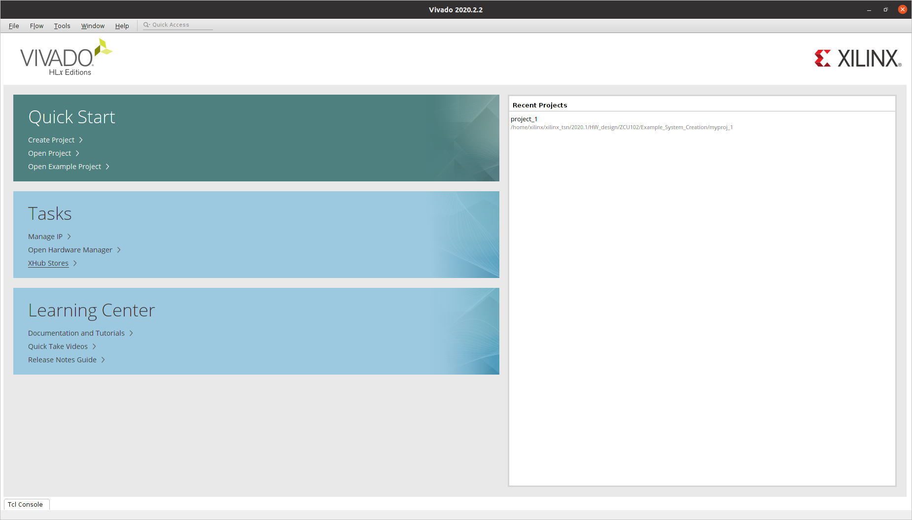

# HowTo and Troubleshooting

<!-- ////////// -->
<!-- ////////// -->
<!--     KV260  -->
<!-- ////////// -->
<!-- ////////// -->
## KV260

#### How do I update the KV260 firmware ?
According to [https://xilinx-wiki.atlassian.net/wiki/spaces/A/pages/1641152513/Kria+K26+SOM#Boot-FW-via-xmutil](https://xilinx-wiki.atlassian.net/wiki/spaces/A/pages/1641152513/Kria+K26+SOM#Boot-FW-via-xmutil) initial KV260 boards were shipped with a firmware that requires an update for `xmutil` tools to work appropriately. The corresponding firmware can be fetched from [https://www.xilinx.com/member/forms/download/xef.html?filename=XilinxSom_QspiImage_v1.1_20210422.bin](https://www.xilinx.com/member/forms/download/xef.html?filename=XilinxSom_QspiImage_v1.1_20210422.bin).


#### How do I emulate KV260 images?

In Vitis 2020.2 there's a bug which limits the emulation capabilities with KV260. The current images are able to boot only up until the ramfs and end up in something like:

```bash
...
SOM: CARRIER_CARD: REVISION:
NO CARRIER DTBO FOUND, PLEASE CHECK /boot/devicetree/
Waiting for /dev/mmcblk0p2 to pop up (attempt 1)
Waiting for /dev/mmcblk0p2 to pop up (attempt 2)
Waiting for /dev/mmcblk0p2 to pop up (attempt 3)
Waiting for /dev/mmcblk0p2 to pop up (attempt 4)
Waiting for /dev/mmcblk0p2 to pop up (attempt 5)
Waiting for /dev/mmcblk0p2 to pop up (attempt 6)
Waiting for /dev/mmcblk0p2 to pop up (attempt 7)
Waiting for /dev/mmcblk0p2 to pop up (attempt 8)
Waiting for /dev/mmcblk0p2 to pop up (attempt 9)
Waiting for /dev/mmcblk0p2 to pop up (attempt 10)
Device /dev/mmcblk0p2 not found
ERROR: There's no '/dev' on rootfs.
```

To finalize the boot, manually type the following:

```bash
mkdir /configfs
mount -t configfs configfs /configfs
cd /configfs/device-tree/overlays/
mkdir full
mkdir /lib/firmware/
cp /boot/devicetree/zynqmp-sck-kv-g-qemu.dtbo /lib/firmware/.
echo -n "zynqmp-sck-kv-g-qemu.dtbo" > full/path
exec /init

```

this should lead you all the way down to the prompt:

```bash
...
Starting system log daemon...0
Starting kernel log daemon...0
Starting crond: OK
Starting tcf-agent: OK
Starting TCG TSS2 Access Broker and Resource Management daemon: device driver not loaded, skipping.

PetaLinux 2020.2.2 xilinx-k26-starterkit-2020_2.2 ttyPS0

xilinx-k26-starterkit-2020_2 login:
```


#### How do I configure the KV260 to JTAG boot mode?

The easiest way to do so is through a Tcl script and the Xilinx Software Commandline Tool (`xsct`). Connect the board to the computer via its USB/UART/JTAG FTDI adapter and power it on:

```bash
source /tools/Xilinx/Vitis/2021.2/settings64.sh  # path might be different in your machine
cat << 'EOF' > som_bootmode.tcl

proc boot_jtag { } {
############################
# Switch to JTAG boot mode #
############################
targets -set -nocase -filter {name =~ "PSU"}
stop
# update multiboot to ZERO
mwr 0xffca0010 0x0
# change boot mode to JTAG
mwr 0xff5e0200 0x0100
# reset
rst -system

}
EOF

xsct
...

xsct%
xsct%
xsct%
xsct% source som_bootmode.tcl
xsct% connect
attempting to launch hw_server

****** Xilinx hw_server v2020.2.2
  **** Build date : Feb  9 2021 at 05:51:02
    ** Copyright 1986-2021 Xilinx, Inc. All Rights Reserved.

INFO: hw_server application started
INFO: Use Ctrl-C to exit hw_server application

INFO: To connect to this hw_server instance use url: TCP:127.0.0.1:3121

tcfchan#0
xsct%
xsct% ta
  2  PS TAP
     3  PMU
     4  PL
  6  PSU
     7  RPU
        8  Cortex-R5 #0 (Halted)
        9  Cortex-R5 #1 (Lock Step Mode)
    10  APU
       11  Cortex-A53 #0 (Running)
       12  Cortex-A53 #1 (Power On Reset)
       13  Cortex-A53 #2 (Power On Reset)
       14  Cortex-A53 #3 (Power On Reset)
xsct%
xsct% boot_jtag
xsct% exit
```

That's it, now JTAG boot mode is set :).

#### I can't set JTAG boot mode because xsct is not behaving as expected?

If you're getting the following behavior:

```bash
xsct  # enter the Xilinx Software Command-Line Tool
xsct% source ./som_bootmode.tcl
xsct%
xsct%
xsct% connect
attempting to launch hw_server

****** Xilinx hw_server v2020.2.2
  **** Build date : Feb  9 2021 at 05:51:02
    ** Copyright 1986-2021 Xilinx, Inc. All Rights Reserved.

INFO: hw_server application started
INFO: Use Ctrl-C to exit hw_server application

INFO: To connect to this hw_server instance use url: TCP:127.0.0.1:3121

tcfchan#0
xsct% ta
xsct% boot_jtag
no targets found with "name =~ "PSU"". available targets: none
xsct%

```

Chances are you've got the wrong drivers. Install the ones that come with Vivado as documented at https://forums.xilinx.com/t5/Xilinx-Evaluation-Boards/Unable-to-connect-to-ZCU104-with-Ubuntu-16-04LTS/td-p/889856:

```bash
cd /tools/Xilinx/Vivado/2020.2/data/xicom/cable_drivers/lin64/install_script/install_drivers
sudo ./install_drivers
[sudo] password for xilinx:
INFO: Installing cable drivers.
INFO: Script name = ./install_drivers
INFO: HostName = xilinx
INFO: Current working dir = /tools/Xilinx/Vivado/2020.2/data/xicom/cable_drivers/lin64/install_script/install_drivers
INFO: Kernel version = 5.10.37-rt39-tsn-measurements.
INFO: Arch = x86_64.
Successfully installed Digilent Cable Drivers
--File /etc/udev/rules.d/52-xilinx-ftdi-usb.rules does not exist.
--File version of /etc/udev/rules.d/52-xilinx-ftdi-usb.rules = 0000.
--Updating rules file.
--File /etc/udev/rules.d/52-xilinx-pcusb.rules does not exist.
--File version of /etc/udev/rules.d/52-xilinx-pcusb.rules = 0000.
--Updating rules file.

INFO: Digilent Return code = 0
INFO: Xilinx Return code = 0
INFO: Xilinx FTDI Return code = 0
INFO: Return code = 0
INFO: Driver installation successful.
CRITICAL WARNING: Cable(s) on the system must be unplugged then plugged back in order for the driver scripts to update the cables.

```

#### How can I deal with "[XRT] ERROR: No devices found" issues when launching an accelerated app?

!!! note
    This is caused by issues within the `2020.2.2` PetaLinux BSP release. `2021.1` should address these issues.

If when launching accelerated applications you observe the following

```bash
XRT build version: 2.8.0
Build hash: b94857f15ba8c8251df446e8c51af7e0a7c9e061
Build date: 2021-06-11 07:18:33
Git branch: 2020.2
PID: 1694
UID: 0
[Sat Jul 31 16:33:09 2021 GMT]
HOST: xilinx-k26-starterkit-2020_2.2
EXE: /ros2_ws/lib/faster_vadd_publisher/faster_vadd
[XRT] ERROR: No devices found
[XRT] ERROR: No devices found
[XRT] ERROR: No devices found
ERROR: Failed to find Xilinx platform
```

And `xbutil` shows an error like the following one:

```bash
xilinx-k26-starterkit-2020_2:/ros2_ws/lib/faster_vadd_publisher# xbutil list
INFO: Found total 1 card(s), 1 are usable
~~~~~~~~~~~~~~~~~~~~~~~~~~~~~~~~~~~~~~~~~~~~~~~~~~~~~~~~~~~~~~~~~~~~~~~~~~~~~~~~
System Configuration
OS name:	Linux
Release:	5.4.0-xilinx-v2020.2
Version:	#1 SMP Thu Jun 10 22:03:38 UTC 2021
Machine:	aarch64
Glibc:		2.30
Distribution:	N/A
Now:		Sat Jul 31 16:40:06 2021 GMT
~~~~~~~~~~~~~~~~~~~~~~~~~~~~~~~~~~~~~~~~~~~~~~~~~~~~~~~~~~~~~~~~~~~~~~~~~~~~~~~~
XRT Information
Version:	2.8.0
Git Hash:	b94857f15ba8c8251df446e8c51af7e0a7c9e061
Git Branch:	2020.2
Build Date:	2021-06-11 07:18:33
ZOCL:		2.8.0,b94857f15ba8c8251df446e8c51af7e0a7c9e061
Failed to open device[0]
ERROR: Card index 0 is out of range
```

then, chances are your device tree does not include the corresponding `zocl` entry. A quick fix to to manually add it and rebuild the blob. To do so, get the sources from the device tree blob:
```bash
dtc -I dtb -O dts -o system.dts system.dtb
```
Edit `system.dts` and add the following:
```
                zyxclmm_drm {
                        compatible = "xlnx,zocl";
                        status = "okay";
                };
```
Build again the device tree into its blob:
```bash
dtc -I dts -O dtb -o system.dtb system.dts
```

After this, a good looking tree should have the following response:

```bash
xbutil list
INFO: Found total 1 card(s), 1 are usable
~~~~~~~~~~~~~~~~~~~~~~~~~~~~~~~~~~~~~~~~~~~~~~~~~~~~~~~~~~~~~~~~~~~~~~~~~~~~~~~~
System Configuration
OS name:	Linux
Release:	5.4.0-xilinx-v2020.2
Version:	#1 SMP Thu Jun 10 22:03:38 UTC 2021
Machine:	aarch64
Glibc:		2.30
Distribution:	N/A
Now:		Wed Aug  4 14:49:47 2021 GMT
~~~~~~~~~~~~~~~~~~~~~~~~~~~~~~~~~~~~~~~~~~~~~~~~~~~~~~~~~~~~~~~~~~~~~~~~~~~~~~~~
XRT Information
Version:	2.8.0
Git Hash:	b94857f15ba8c8251df446e8c51af7e0a7c9e061
Git Branch:	2020.2
Build Date:	2021-06-11 07:18:33
ZOCL:		2.8.0,b94857f15ba8c8251df446e8c51af7e0a7c9e061
 [0]:edge
```

## Basic embedded

#### How do I install a package built with PetaLinux in my embedded target?

You can build individual packages with PetaLinux using the following syntax:

```bash
petalinux-build -c <package>  # e.g. petalinux-build -c dfx-mgr
```
the resulting package will be built and archived, resulting in an `.rpm` file which you can often find at `build/tmp/deploy/rpm/aarch64/dfx-mgr*.rpm`.

We can install this in the embedded target as follows:
```bash
# host
scp build/tmp/deploy/rpm/aarch64/dfx-mgr*.rpm root@192.168.1.86:~/  # copy them

# embedded target
rpm -i --force dfx-mgr-1.0-r0.aarch64.rpm  # force install to overwrite same version
```

#### How do I get the sources (.dts) from a device tree blob (.dtb)?

```bash
dtc -I dtb -O dts -o system.dts system.dtb
```

#### How do I build a device tree blob (.dtb) from the sources (.dts)?

```bash
dtc -I dts -O dtb -o system.dtb system.dts
```

#### How do I get a better gdb debugging environment?
```
wget -P ~ https://git.io/.gdbinit
```

#### Get do I get a serial to ZCU10X boards?

Use a simple TTY terminal application. There're various you could use: `minicom`, `picocom`, etc.

I like [tio](https://tio.github.io/):

```bash
sudo apt-get install tio
sudo tio /dev/ttyUSB0
```

#### Get HDMI in my ZCU10X boards?

Through the DisplayPort port. We support selected connectors. The following have been tested:

| Product | Works |
|---------|-------|
| JSAUX JSESNZ4KDP2HDF | ==Yes== |
| J5create JDA158 | ==Yes== |
| IVANKY-DP11 | No |
| ICZI  IZEC-A10-IT  | No |
| Snowkids cable | No |

#### How do I calculate the offsets for the raw `.img` images, so that I can mount them?

Offsets can be inspected in the following manner:
```bash
fdisk -l <path-to-img>/sd_card.img
Disk /home/xilinx/ros2_ws/acceleration/firmware/xilinx/sd_card.img: 2.47 GiB, 2635071488 bytes, 5146624 sectors
Units: sectors of 1 * 512 = 512 bytes
Sector size (logical/physical): 512 bytes / 512 bytes
I/O size (minimum/optimal): 512 bytes / 512 bytes
Disklabel type: dos
Disk identifier: 0xe29caf3d

Device                                          Boot   Start     End Sectors  Size Id Type
/home/xilinx/ros2_ws/acceleration/firmware/xilinx/sd_card.img1 *       2048 2000895 1998848  976M 83 Linux
/home/xilinx/ros2_ws/acceleration/firmware/xilinx/sd_card.img2      2000896 5146623 3145728  1.5G 83 Linux
```

To calculate them, multiple the `End` by the `Units`. For example, for the second partition:
```bash
echo $(($(fdisk -l /home/xilinx/ros2_ws/acceleration/firmware/xilinx/sd_card.img | grep 'img2' | awk '{print $2}') * $(fdisk -l /home/xilinx/ros2_ws/acceleration/firmware/xilinx/sd_card.img | grep 'Units' | awk '{print $8}')))
1024458752
```

#### How do I mount a `.img` file for inspection?

!!! note
    The offsets need to be calculated first.

Raw image files contain several partitions. The first one is often the boot partition and the second one typically contains the file system. The following two commands will help mount the first two:

```bash
# mount boot partition
mkdir -p /tmp/sdcard_img_p1 && sudo mount -o loop,offset=1048576 /home/xilinx/ros2_ws/acceleration/firmware/xilinx/sd_card.img /tmp/sdcard_img_p1

# mount rootfs partition
mkdir -p /tmp/sdcard_img_p2 && sudo mount -o loop,offset=588251136 /home/xilinx/ros2_ws/acceleration/firmware/xilinx/sd_card.img /tmp/sdcard_img_p2
```

To umount:

```bash
sudo umount /tmp/sdcard_img_p1  # or *_p2, as appropriate
```

#### How do I create an initramfs from an rootfs partition?

See [^32] for more details:

```bash
colcon acceleration mkinitramfs out.cpio.gz
```

Alternatively:
```bash
# mount sd card rootfs partition
sudo mount -o loop,offset=1024458752 /home/xilinx/ros2_ws/acceleration/firmware/xilinx/sd_card.img /tmp/sdcard_img_p2
# create script, no variable expansion
cat << 'EOF' > mkinitramfs.sh
#!/bin/sh

# Copyright 2006 Rob Landley <rob@landley.net> and TimeSys Corporation.
# Licensed under GPL version 2

if [ $# -ne 2 ]
then
    echo "usage: mkinitramfs directory imagename.cpio.gz"
    exit 1
fi

if [ -d "$1" ]
then
    echo "creating $2 from $1"
    (cd "$1"; find . | cpio -o -H newc | gzip) > "$2"
else
    echo "First argument must be a directory"
    exit 1
fi
EOF
chmod +x mkinitramfs.sh
# create initramfs
sudo ./mkinitramfs.sh /tmp/sdcard_img_p2 test.cpio.gz
```

#### How do I handle corrupted sd_card.img files?

It's been observed that `sd_card.img` files get sometimes corrupted but neither `ddrescue` nor `testdisk` helped recovering them. The typicaly behavior observed in a corrupted image can be reproduced by trying to mount its second partition:

```bash
mkdir -p /tmp/sdcard_img_p2 && sudo mount -o loop,offset=1024458752 /home/xilinx/ros2_ws/acceleration/firmware/xilinx/sd_card.img /tmp/sdcard_img_p2
[sudo] password for xilinx:
NTFS signature is missing.
Failed to mount '/dev/loop1': Invalid argument
The device '/dev/loop1' doesn't seem to have a valid NTFS.
Maybe the wrong device is used? Or the whole disk instead of a
partition (e.g. /dev/sda, not /dev/sda1)? Or the other way around?
```

??? warning "Reproduce this behavior with KRS hypervisor functionality"

    ```bash
    cd ~/ros2_ws/xilinx/firmware
    tar -xzf sd_card.img.tar.gz  # decompress the image
    cd ~/ros2_ws/
    colcon acceleration hypervisor --dom0 vanilla --domU vanilla --ramdisk initrd.cpio  # this works just fine, can mount afterwards
    colcon acceleration hypervisor --dom0 vanilla --domU vanilla --ramdisk initrd.cpio.gz  # this works just fine, can mount afterwards
    colcon acceleration hypervisor --dom0 vanilla --domU vanilla --ramdisk rootfs.cpio.gz  # this works just fine, can mount afterwards
    colcon acceleration hypervisor --dom0 vanilla --domU vanilla --ramdisk test.cpio.gz

    ```

The current solution for this issue is to discard the sd_card.img file and create a new one from the `sd_card.img.tar.gz` file.

!!! note
    This might be related to the fact that p1 in the sd_card is filling and overloading p2.


#### Extracting bitstream from xclbin file:

```bash
xclbinutil --dump-section BITSTREAM:RAW:bitstream.bit --input vadd.xclbin
```

#### How do I figure out version of a kernel binary?

```bash
strings Image | grep "Linux version"
Linux version 5.4.0-xilinx-v2020.2 (oe-user@oe-host) (gcc version 9.2.0 (GCC)) #1 SMP Thu Jun 10 22:03:38 UTC 2021
Linux version %s (%s)
```

or more elaborated:
```bash
strings Image | grep "5\.[0123456789]\.[0123456789]" | grep "Linux version"
Linux version 5.4.0-xilinx-v2020.2 (oe-user@oe-host) (gcc version 9.2.0 (GCC)) #1 SMP Thu Jun 10 22:03:38 UTC 2021
```

#### How do I copy an image to the SD card in OS X from CLI?

```bash
sudo diskutil unmount /dev/rdisk2s1
pv sd_card.img | sudo dd of=/dev/rdisk2 bs=4m
```

#### How do I increase swap in Linux for Vitis/Vivado builds?

For a 30G swap:

```bash
sudo swapoff -a
sudo dd if=/dev/zero of=/swapfile bs=1G count=30
sudo chmod 600 /swapfile
sudo mkswap /swapfile
sudo swapon /swapfile
```

To fix things at boot, edit `/etc/fstab ` and add:
```
/swapfile none swap sw 0 0
```

## Network boot

#### TFTP server

```bash
cat << EOF > /etc/xinetd.d/tftp
service tftp
{
    protocol        = udp
    port            = 69
    socket_type     = dgram
    wait            = yes
    user            = xilinx
    server          = /usr/sbin/in.tftpd
    server_args     = /srv/tftp
    disable         = no
}
EOF
sudo systemctl status xinetd.service
setenv ipaddr 192.168.1.86
setenv serverip 192.168.1.33
tftpb 0xC00000 xen_boot_tftp.scr  # fetch one file in address 0xC00000
source 0xC00000
```

#### iPXE

iPXE is the "swiss army knife" of network booting. It supports both HTTPS and iSCSI. In addition, it has a script engine for fine grained control of the boot process and can provide a command shell. iPXE can be built as an EFI application (named snp.efi) which can be loaded and run by U-Boot:

```bash
# compile iPXE
git clone http://git.ipxe.org/ipxe.git
cd ipxe/src/
cat << EOF > myscript.ipxe
#!ipxe

dhcp
:loop
echo Hello world
goto loop
EOF
make CROSS_COMPILE=aarch64-linux-gnu- ARCH=arm64 bin-arm64-efi/snp.efi -j6 EMBED=myscript.ipxe

# copy to tftp folder
cp bin-arm64-efi/snp.efi /srv/tftp

# in the embedded board, fetch result
setenv ipaddr 192.168.1.86
setenv serverip 192.168.1.33
tftpb 0xC00000 snp.efi
bootefi 0xc00000
```

that'll get us something like:

```bash
ZynqMP> tftpb 0xC00000 snp.efi
Using ethernet@ff0e0000 device
TFTP from server 192.168.1.33; our IP address is 192.168.1.86
Filename 'snp.efi'.
Load address: 0xc00000
Loading: #######################################
	 3.7 MiB/s
done
Bytes transferred = 197632 (30400 hex)
ZynqMP> bootefi 0xc00000
Scanning disk mmc@ff170000.blk...
Found 3 disks
efi_load_pe: Invalid DOS Signature
iPXE initialising devices...ok


iPXE 1.21.1+ (g3ae83) -- Open Source Network Boot Firmware -- http://ipxe.org
Features: DNS HTTP iSCSI TFTP AoE EFI Menu
Configuring (net0 00:0a:35:00:22:01)...... ok
Hello world
Hello world
Hello world
Hello world
Hello world
...
```

Alternatively, one could deposit the iPXE binary in the boot partition and create a boot script to automate it. The following example creates the boot script and fetches it over TFTP (it could also be pushed into the boot partition in which case will initiate automatically):

```bash
# create source file and compile it as a script for u-boot
cat << EOF > boot.source
load mmc 0:1 0xE00000 snp.efi
bootefi 0xE00000
EOF
mkimage -A arm -O linux -T script -C none -n "u-boot commands" -d boot.source boot.scr
# copy to tftp directory and test it manually
cp boot.scr /srv/tftp

# within u-boot
tftpb 0xC00000 boot.scr
source 0xC00000
## Executing script at 00c00000
197632 bytes read in 39 ms (4.8 MiB/s)
Scanning disk mmc@ff170000.blk...
** Unrecognized filesystem type **
Found 3 disks
efi_load_pe: Invalid DOS Signature
iPXE initialising devices...ok


iPXE 1.21.1+ (g3ae83) -- Open Source Network Boot Firmware -- http://ipxe.org
Features: DNS HTTP iSCSI TFTP AoE EFI Menu
Configuring (net0 00:0a:35:00:22:01)...... ok
Hello world
Hello world
Hello world
Hello world
Hello world
...
```

#### How do I create boot scripts from their sources?

```bash
mkimage -c none -A arm -T script -d boot.source boot.scr
```


#### I can't boot my image because I get a kernel panic like the following one

```bash
[    4.549695] cfg80211: Loaded X.509 cert 'sforshee: 00b28ddf47aef9cea7'
[    4.550434] clk: Not disabling unused clocks
[    4.579404] ALSA device list:
[    4.579697]   No soundcards found.
[    4.589301] platform regulatory.0: Direct firmware load for regulatory.db failed with error -2
[    4.590014] cfg80211: failed to load regulatory.db
[    4.609105] List of all partitions:
[    4.610016] 0100           65536 ram0
[    4.610034]  (driver?)
[    4.610678] 0101           65536 ram1
[    4.610683]  (driver?)
[    4.611911] 0102           65536 ram2
[    4.611915]  (driver?)
[    4.612126] 0103           65536 ram3
[    4.612129]  (driver?)
[    4.612401] 0104           65536 ram4
[    4.612405]  (driver?)
[    4.612617] 0105           65536 ram5
[    4.612620]  (driver?)
[    4.613813] 0106           65536 ram6
[    4.613817]  (driver?)
[    4.614004] 0107           65536 ram7
[    4.614055]  (driver?)
[    4.614430] 0108           65536 ram8
[    4.614435]  (driver?)
[    4.614645] 0109           65536 ram9
[    4.614649]  (driver?)
[    4.614953] 010a           65536 ram10
[    4.614958]  (driver?)
[    4.615299] 010b           65536 ram11
[    4.615305]  (driver?)
[    4.615627] 010c           65536 ram12
[    4.615631]  (driver?)
[    4.615957] 010d           65536 ram13
[    4.615961]  (driver?)
[    4.616295] 010e           65536 ram14
[    4.616298]  (driver?)
[    4.616614] 010f           65536 ram15
[    4.616618]  (driver?)
[    4.617030] 1f00           30720 mtdblock0
[    4.617054]  (driver?)
[    4.617373] 1f01             256 mtdblock1
[    4.617379]  (driver?)
[    4.617653] 1f02           36864 mtdblock2
[    4.617666]  (driver?)
[    4.618745] b300         2573312 mmcblk0
[    4.618774]  driver: mmcblk
[    4.619190]   b301          999424 mmcblk0p1 e29caf3d-01
[    4.619204]
[    4.619532]   b302         1572864 mmcblk0p2 e29caf3d-02
[    4.619536]
[    4.619883] No filesystem could mount root, tried:
[    4.619909]  ext3
[    4.620114]  ext2
[    4.620170]  ext4
[    4.620222]  cramfs
[    4.620274]  vfat
[    4.620326]  msdos
[    4.620375]  iso9660
[    4.620427]  btrfs
[    4.620486]
[    4.620735] Kernel panic - not syncing: VFS: Unable to mount root fs on unknown-block(1,0)
[    4.620979] CPU: 0 PID: 1 Comm: swapper/0 Tainted: G        W         5.4.0-xilinx-v2020.2 #1
[    4.621158] Hardware name: ZynqMP ZCU102 Rev1.0 (DT)
[    4.621283] Call trace:
[    4.621374]  dump_backtrace+0x0/0x140
[    4.621462]  show_stack+0x14/0x20
[    4.621553]  dump_stack+0xac/0xd0
[    4.621713]  panic+0x140/0x30c
[    4.621884]  mount_block_root+0x254/0x284
[    4.622123]  mount_root+0x124/0x158
[    4.622338]  prepare_namespace+0x15c/0x1a4
[    4.622561]  kernel_init_freeable+0x234/0x258
[    4.622815]  kernel_init+0x10/0xfc
[    4.623047]  ret_from_fork+0x10/0x18
[    4.623774] Kernel Offset: disabled
[    4.624068] CPU features: 0x0002,24002004
[    4.624218] Memory Limit: none
[    4.624790] ---[ end Kernel panic - not syncing: VFS: Unable to mount root fs on unknown-block(1,0) ]---
```

This is often indicator that the kernel's not finding the root file system. This might be caused by tools to generate boot scripts (`boot.scr`) automatically. Make sure the boot line of your boot scripts points to your rootfs partition (e.g. `/dev/mmcblk0p2`).


<!-- ////////// -->

## PetaLinux

#### How do I setup the ROS 2 BSP?

```bash
git clone https://gitlab.com/xilinxrobotics/zcu102/bsp
source /tools/Xilinx/PetaLinux/2020.2/bin/settings.sh
petalinux-create -t project -s bsp/xilinx-zcu102-2020.2-ros2-foxy.bsp
cd xilinx-zcu102-2020.2
mkdir -p build/conf
cp project-spec/configs/plnxtool.conf build/conf/
cp project-spec/configs/bblayers.conf build/conf/

# IMPORTANT: fix bug manually
# Edit build/conf/bblayers.conf and remove the last workspace line
#

petalinux-config --silentconfig  # generate additional files
echo 'ROS_DISTRO = "foxy"' >> build/conf/bblayers.conf

# NOTE: you might need to do what's described in:
#  How do I deal with the following error: Could not inherit file classes/ros_distro_${ROS_DISTRO}.bbclass

petalinux-build  # takes about 30 mins
```

#### How do I deal with the following error: Could not inherit file classes/ros_distro_${ROS_DISTRO}.bbclass?

When building the Yocto project with ROS, you may face:
```bash
petalinux-build  # takes about 30 mins
INFO: Sourcing build tools
[INFO] Building project
[INFO] Sourcing build environment
[INFO] Generating workspace directory
INFO: bitbake petalinux-image-minimal
WARNING: Layer example should set LAYERSERIES_COMPAT_example in its conf/layer.conf file to list the core layer names it is compatible with.
WARNING: Host distribution "ubuntu-20.04" has not been validated with this version of the build system; you may possibly experience unexpected failures. It is recommended that you use a tested distribution.
ERROR: ParseError at /home/xilinx/xilinx-zcu102-2020.2/project-spec/meta-user/recipes-images/images/petalinux-image-ros2-basic.bb:6: Could not inherit file classes/ros_distro_${ROS_DISTRO}.bbclass40

Summary: There were 2 WARNING messages shown.
Summary: There was 1 ERROR message shown, returning a non-zero exit code.
ERROR: Failed to build project
```

Add the following to the `BBLAYERS` variable in the `build/conf/bblayers.conf` file:

```bash
  ${SDKBASEMETAPATH}/../../project-spec/meta-ros/meta-ros2-foxy \
  ${SDKBASEMETAPATH}/../../project-spec/meta-ros/meta-ros2 \
  ${SDKBASEMETAPATH}/../../project-spec/meta-ros/meta-ros-common \
  ${SDKBASEMETAPATH}/../../project-spec/meta-ros/meta-ros-backports-dunfell \
  ${SDKBASEMETAPATH}/../../project-spec/meta-user \
```

#### How to update the pre-built directory in a PetaLinux/Yocto project

```bash
petalinux-package --prebuilt
```

#### How to create a project out of the BSP

E.g. from [ZCU102 Robotics BSP](https://gitlab.com/xilinxrobotics/zcu102/bsp):

```bash
petalinux-create -t project -s <location-to>/xilinx-zcu102-2020.2-ros2-foxy.bsp
```

#### How to generate a BSP (out of a PetaLinux/Yocto project):

```bash
petalinux-package --bsp --o /tmp/xilinx-zcu102-2020.2-ros2-foxy.bsp -p $(pwd)
```


#### How to launch a quick emulation from the BSP pre-built packages:

```bash
petalinux-boot --qemu --prebuilt 3
```

#### How to launch a quick emulation from images/linux folder (just built artifacts):

```bash
petalinux-boot --qemu --kernel
```

#### How to launch a quick emulation from a built PetaLinux/Yocto project using a TFTP directory (fetching things from TFTP):

```bash
petalinux-boot --qemu --prebuilt 2 --qemu-args "-net nic -net nic -net nic -net nic -net user,tftp=images/linux/tftpboot,hostfwd=tcp:127.0.0.1:2222-10.0.2.15:22"
```

#### How to add the rootfs resulting from a new build to a pre-built `.img`?
Partially inspired by [^26]:

```bash
# mount p2, which contains the rootfs
sudo mount -o loop,offset=1024458752 /home/xilinx/ros2_ws/acceleration/firmware/xilinx/sd_card.img /tmp/sdcard_img_p2
# extract new rootfs on .cpio format
cd /tmp/sdcard_img_p2
sudo cpio -idv < /media/xilinx/hd/xilinx-zcu102-2020.2/images/linux/rootfs.cpio
```

or if the file available is gzipped:

```bash
cat /home/xilinx/ros2_ws/acceleration/firmware/xilinx/rootfs.cpio.gz | gunzip | sudo cpio -idv
```

#### How to find Linux Kernel Latencies
Inspired by [^26]:
```bash
# run cyclictests for 10 seconds
# NOTE: you should run benchmarks for a much longer time
cyclictest --smp -p95 -m -D 10
```

#### How to generate the `BOOT.BIN` file?
```bash
petalinux-package --boot \
   --fsbl images/linux/zynqmp_fsbl.elf \
   --u-boot images/linux/u-boot.elf \
   --pmufw images/linux/pmufw.elf \
   --atf images/linux/bl31.elf
```

#### How do I compile a PREEMPT_RT patched environment?

```bash
petalinux-build -c linux-xlnx -x distclean  # clean up kernel build files
petalinux-config -c kernel  # get the kernel under components for configuration, do not modify anything
cd components/yocto/workspace/sources/linux-xlnx/  # head to the kernel source tree
wget http://cdn.kernel.org/pub/linux/kernel/projects/rt/5.4/older/patch-5.4.10-rt4.patch.gz  # fetch patches
zcat patch-5.4.10-rt4.patch.gz | patch -p1  # apply patches

# manual fixes, unfortunately patches are a hack and not meant for this version. Need to:
#   Change instances of spin_lock for raw_spin_lock in function rescuer_thread(). See
#   https://gitlab.com/xilinxrobotics/docs/-/issues/11#note_523328000 for the actual fixes.

cd ../../../../.. # then back to the root of the project and:
petalinux-config -c kernel  # configure PREEMPT_RT options, setting to =y the following
# CONFIG_PREEMPT_RT
# CONFIG_HIGH_RES_TIMERS
# CONFIG_NO_HZ_FULL
# CONFIG_HZ_1000
# CPU_FREQ_DEFAULT_GOV_PERFORMANCE
petalinux-build
```

*Done with 2020.2*


#### How do I set up TSN in a Yocto/PetaLinux project?

1. `git clone https://gitlab.com/xilinxrobotics/meta-tsn` under project*
2. `build/conf/local.conf` as in https://gist.github.com/vmayoral/f93d0070b93d9a7f43756ae9ae9c0bc3
3. Edit `build/conf/bblayers.conf` and add

```bash
  ${SDKBASEMETAPATH}/../../project-spec/meta-tsn/meta-xilinx-tsn \
```

4. Also, change the machine name in `petalinux-config` to match the one matching the config of the TSN IP core. Use `zcu102-zynqmp` instead (Yocto Seetings --> `YOCTO_MACHINE_NAME`)
5. Pick up the right hardware description file so that the right `dtb` is generated. E.g.:

```bash
petalinux-config --get-hw-description project-spec/meta-tsn/tsn-packages/design/zcu102-zynqmp/
```
6. `petalinux-build`


#### How do I set up Xen in PetaLinux?

To set up Xen hypervisor in PetaLinux, follow the [Confluence instructions](https://xilinx-wiki.atlassian.net/wiki/spaces/A/pages/384663561/Building+Xen+Hypervisor+with+Petalinux+2020.1+and+2020.2#BuildingXenHypervisorwithPetalinux2020.1and2020.2-RunXendom0onQEMU).

#### How do I set up XRT in PetaLinux?

To set up XRT in PetaLinux, follow [these instructions](https://xilinx.github.io/XRT/2020.2/html/yocto.html#create-petalinux-project-with-xrt).


#### How do I clean up a PetaLinux component?
There're different ways to do. See PetaLinux Command Line Reference UG1157 for more details:

```bash
petalinux-buid -c <component> -x <verb>
```

wherein `<component>` corresponds with one of the recipes, e.g. `u-boot`.

| verb | Description |
|-----------|-------------|
| `clean` | Cleans build data for the target component.|
| `cleansstate` | This removes the sstate cache of the corresponding component.|
| `distclean` | This removes the sstate cache of the corresponding component.|
| `cleanall` | This removes the downloads, sstate cache and cleans the work directory of a component.|
| `mrproper` | Cleans the build area. This removes the `<plnx-proj-root>/build/` and `<plnx-proj-root>/images/directories` |

#### How do I build an SDK out of a PetaLinux project?

The following command builds SDK and copies it at `<proj_root>/images/linux/sdk.sh`:
```bash
petalinux-build --sdk
```
The following is the equivalent bitbake command bitbake
```bash
petalinux-user-image -c do_populate_sdk
```


<!-- /////////////// -->
## Xen and mixed-criticality

#### How do I switch in between consoles/serial inputs (Dom0, Dom1, Xen)?

Press Ctrl-aaa **twice**.

#### How do I connect to a VM from Dom0?

```bash
xl console domU0  # or whatever the domain name is
```

#### Why there's no prompt in Dom0 after boot?

The default FS built with PetaLinux may contain a wrong configuration. Make sure that the following is set appropriately in `/etc/inittab`
```
#PS0:12345:respawn:/bin/start_getty 115200 ttyPS0 vt102
X0:12345:respawn:/sbin/getty 115200 hvc0
```

#### How do I create a Dom0less setup?
By default, VMs created with the Imagebuilder tool (e.g. `uboot-script-gen`) through configuration scripts are dom0less at the time of writing. For example, in the following piece, Dom1 is Dom0less:

```bash
MEMORY_START="0x0"
MEMORY_END="0x80000000"

DEVICE_TREE="system.dtb"
XEN="xen"
DOM0_KERNEL="Image"
DOM0_RAMDISK="initrd.cpio"

NUM_DOMUS=1
DOMU_KERNEL[0]="Image"
DOMU_RAMDISK[0]="initrd.cpio"

UBOOT_SOURCE="boot.source"
UBOOT_SCRIPT="boot.scr"
```

#### How do I create DomU machines then?

Through the `xl` tooling. For example:

```bash
# create config file and launch VM
cd /etc/xen
cat << EOF > example-minimalistic.cfg
name = "guest0"
kernel = "/media/sd-mmcblk0p1/Image"
ramdisk = "/media/sd-mmcblk0p1/initrd.cpio"
memory = 256
EOF
xl create -c example-minimalistic.cfg

```

You can exit Xen pressing `Ctrl-]` and then check that the VM is running:

```bash
root@xilinx-zcu102-2020_2-ros2-foxy:/etc/xen# xl list
Name                                        ID   Mem VCPUs	State	Time(s)
Domain-0                                     0  1024     1     r-----     206.3
guest0                                       2   255     1     r-----       9.0
```

#### What are VMs with no name?
When VMs are dom0less, they will get presented as follows:

```bash
root@xilinx-zcu102-2020_2-ros2-foxy:/# xl list
Name                                        ID   Mem VCPUs	State	Time(s)
(null)                                       0  1024     1     r-----     722.6
(null)                                       1   512     1     r-----     722.6
```

One way to attempt to access these VMs is by switching between serials/consoles as described above.


#### How do I exit from a DomU without stopping it and get back to Dom0?

Press `Ctrl-]`. That'll exit from the DomU console.


#### DomU VMs are not initiating with an error like the following

It's been observe that PetaLinux creates file systems that miss some Xen-related folders. This leads to issues initiating DomUs:

```bash
xl create -c example-minimalistic.c
Parsing config from example-minimalistic.cfg
libxl: error: libxl_domain.c:1405:libxl__get_domid: failed to get own domid (domid)
libxl: error: libxl_dm.c:3415:libxl__need_xenpv_qemu: unable to get domain id
libxl: error: libxl_domain.c:1405:libxl__get_domid: failed to get own domid (domid)
libxl: error: libxl_internal.c:421:libxl__lock_domain_userdata: Domain 2:cannot open lockfile /var/lib/xen/userdata-l.2.f10ed589-4870-40d0-a4cc-758e10e8c9e3.domain-userdata-lock, errno=2: No such file or directory
libxl: error: libxl_domain.c:1131:domain_destroy_callback: Domain 2:Unable to destroy guest
libxl: error: libxl_create.c:1826:domcreate_destruction_cb: Domain 2:unable to destroy domain following failed creation
libxl: error: libxl_xshelp.c:201:libxl__xs_read_mandatory: xenstore read failed: `/libxl/2/type': No such file or directory
libxl: warning: libxl_dom.c:52:libxl__domain_type: unable to get domain type for domid=2, assuming HVM
libxl: error: libxl_internal.c:421:libxl__lock_domain_userdata: Domain 2:cannot open lockfile /var/lib/xen/userdata-l.2.f10ed589-4870-40d0-a4cc-758e10e8c9e3.domain-userdata-lock, errno=2: No such file or directory
libxl: error: libxl_domain.c:1131:domain_destroy_callback: Domain 2:Unable to destroy guest
libxl: error: libxl_domain.c:1058:domain_destroy_cb: Domain 2:Destruction of domain failed
```

The reason why this is happening is because Xen is missing some folders which block from it to behave normally. This is illustrated also by the following error present in the boot log:
```bash
libxl: error: libxl_internal.c:421:libxl__lock_domain_userdata: Domain 0:cannot open lockfile /var/lib/xen/userdata-l.0.00000000-0000-0000-0000-000000000000.domain-userdata-lock, errno=2: No such file or directory
```

The solution is to manually create the missing folder and reboot:

```bash
mkdir /var/lib/xen
reboot
```

#### How do I deal with kernel errors while building Xen with PetaLinux?

When facing the following error:

```bash
NOTE: Setscene tasks completed
ERROR: petalinux-image-minimal-1.0-r0 do_rootfs: Could not invoke dnf. Command '/home/xilinx/xilinx-zcu102-2020.2/build/tmp/work/zcu102_zynqmp-xilinx-linux/petalinux-image-minimal/1.0-r0/recipe-sysroot-native/usr/bin/dnf -v --rpmverbosity=info -y -c /home/xilinx/xilinx-zcu102-2020.2/build/tmp/work/zcu102_zynqmp-xilinx-linux/petalinux-image-minimal/1.0-r0/rootfs/etc/dnf/dnf.conf --setopt=reposdir=/home/xilinx/xilinx-zcu102-2020.2/build/tmp/work/zcu102_zynqmp-xilinx-linux/petalinux-image-minimal/1.0-r0/rootfs/etc/yum.repos.d --installroot=/home/xilinx/xilinx-zcu102-2020.2/build/tmp/work/zcu102_zynqmp-xilinx-linux/petalinux-image-minimal/1.0-r0/rootfs --setopt=logdir=/home/xilinx/xilinx-zcu102-2020.2/build/tmp/work/zcu102_zynqmp-xilinx-linux/petalinux-image-minimal/1.0-r0/temp --repofrompath=oe-repo,/home/xilinx/xilinx-zcu102-2020.2/build/tmp/work/zcu102_zynqmp-xilinx-linux/petalinux-image-minimal/1.0-r0/oe-rootfs-repo --nogpgcheck install base-passwd bridge-utils byobu can-utils cyclonedds demo-nodes-cpp demo-nodes-cpp-rosnative demo-nodes-py ethtool examples-rclcpp-minimal-action-client examples-rclcpp-minimal-action-server examples-rclcpp-minimal-client examples-rclcpp-minimal-composition examples-rclcpp-minimal-publisher examples-rclcpp-minimal-service examples-rclcpp-minimal-subscriber examples-rclcpp-minimal-timer examples-rclcpp-multithreaded-executor examples-rclpy-executors examples-rclpy-minimal-action-client examples-rclpy-minimal-action-server examples-rclpy-minimal-client examples-rclpy-minimal-publisher examples-rclpy-minimal-service examples-rclpy-minimal-subscriber fpga-manager-script gdb libc6-utils haveged hellopm kernel-modules localedef mtd-utils opencl-clhpp opencl-clhpp-dev opencl-headers opencl-headers-dev openssh openssh-scp openssh-sftp-server openssh-ssh openssh-sshd packagegroup-core-boot packagegroup-core-ssh-openssh packagegroup-petalinux-xen packagegroup-petalinux-xrt pciutils python3-argcomplete rmw-cyclonedds-cpp ros-base rpm rt-tests run-postinsts shadow stress tcf-agent tmux udev-extraconf watchdog-init xrt xrt-dev zocl' returned 1:
DNF version: 4.2.2
cachedir: /home/xilinx/xilinx-zcu102-2020.2/build/tmp/work/zcu102_zynqmp-xilinx-linux/petalinux-image-minimal/1.0-r0/rootfs/var/cache/dnf
Added oe-repo repo from /home/xilinx/xilinx-zcu102-2020.2/build/tmp/work/zcu102_zynqmp-xilinx-linux/petalinux-image-minimal/1.0-r0/oe-rootfs-repo
repo: using cache for: oe-repo
not found other for:
not found modules for:
not found deltainfo for:
not found updateinfo for:
oe-repo: using metadata from Wed 26 May 2021 03:15:15 PM UTC.
Last metadata expiration check: 0:00:01 ago on Wed 26 May 2021 03:15:15 PM UTC.
No module defaults found
--> Starting dependency resolution
--> Finished dependency resolution
Error:
 Problem: conflicting requests
  - nothing provides kernel-module-xen-blkback needed by packagegroup-petalinux-xen-1.0-r0.noarch
  - nothing provides kernel-module-xen-gntalloc needed by packagegroup-petalinux-xen-1.0-r0.noarch
  - nothing provides kernel-module-xen-gntdev needed by packagegroup-petalinux-xen-1.0-r0.noarch
  - nothing provides kernel-module-xen-netback needed by packagegroup-petalinux-xen-1.0-r0.noarch
  - nothing provides kernel-module-xen-wdt needed by packagegroup-petalinux-xen-1.0-r0.noarch
(try to add '--skip-broken' to skip uninstallable packages or '--nobest' to use not only best candidate packages)

ERROR: Logfile of failure stored in: /home/xilinx/xilinx-zcu102-2020.2/build/tmp/work/zcu102_zynqmp-xilinx-linux/petalinux-image-minimal/1.0-r0/temp/log.do_rootfs.1714208
ERROR: Task (/home/xilinx/xilinx-zcu102-2020.2/components/yocto/layers/meta-petalinux/recipes-core/images/petalinux-image-minimal.bb:do_rootfs) failed with exit code '1'
NOTE: Tasks Summary: Attempted 9800 tasks of which 9498 didn't need to be rerun and 1 failed.
```


#### DomUs stored in SD partitions create a kernel panic when Launching

If you're running Vitis `2020.2` or earlier and observe something like when creating DomUs:

```bash
...
[    3.257786] cfg80211: Loaded X.509 cert 'sforshee: 00b28ddf47aef9cea7'
[    3.258491] ALSA device list:
[    3.258603]   No soundcards found.
[    3.264081] platform regulatory.0: Direct firmware load for regulatory.db failed with error -2
[    3.264785] cfg80211: failed to load regulatory.db
[    3.318562] random: fast init done
[    3.389439] List of all partitions:
[    3.389763] 0100           65536 ram0
[    3.389800]  (driver?)
[    3.389941] 0101           65536 ram1
[    3.389949]  (driver?)
[    3.390181] 0102           65536 ram2
[    3.390185]  (driver?)
[    3.390318] 0103           65536 ram3
[    3.390324]  (driver?)
[    3.390420] 0104           65536 ram4
[    3.390424]  (driver?)
[    3.390510] 0105           65536 ram5
[    3.390514]  (driver?)
[    3.390926] 0106           65536 ram6
[    3.390931]  (driver?)
[    3.391029] 0107           65536 ram7
[    3.391032]  (driver?)
[    3.391112] 0108           65536 ram8
[    3.391115]  (driver?)
[    3.391301] 0109           65536 ram9
[    3.391305]  (driver?)
[    3.391395] 010a           65536 ram10
[    3.391398]  (driver?)
[    3.391484] 010b           65536 ram11
[    3.391487]  (driver?)
[    3.391573] 010c           65536 ram12
[    3.391578]  (driver?)
[    3.391680] 010d           65536 ram13
[    3.391696]  (driver?)
[    3.391924] 010e           65536 ram14
[    3.391929]  (driver?)
[    3.392739] 010f           65536 ram15
[    3.392744]  (driver?)
[    3.392916] ca00         1656832 xvda
[    3.392945]  driver: vbd
[    3.393071] No filesystem could mount root, tried:
[    3.393173]  ext3
[    3.393266]  ext2
[    3.393337]  ext4
[    3.393378]  cramfs
[    3.393412]  vfat
[    3.393447]  msdos
[    3.393489]  iso9660
[    3.393628]  btrfs
[    3.393681]
[    3.394073] Kernel panic - not syncing: VFS: Unable to mount root fs on unknown-block(202,0)
[    3.395086] CPU: 0 PID: 1 Comm: swapper/0 Not tainted 5.4.0-xilinx-v2020.2 #1
[    3.395268] Hardware name: XENVM-4.13 (DT)
[    3.395587] Call trace:
[    3.395667]  dump_backtrace+0x0/0x140
[    3.395859]  show_stack+0x14/0x20
[    3.396728]  dump_stack+0xac/0xd0
[    3.396825]  panic+0x140/0x30c
[    3.396912]  mount_block_root+0x254/0x284
[    3.396985]  mount_root+0x124/0x158
[    3.397061]  prepare_namespace+0x15c/0x1a4
[    3.397222]  kernel_init_freeable+0x234/0x258
[    3.397396]  kernel_init+0x10/0xfc
[    3.397532]  ret_from_fork+0x10/0x18
[    3.398088] Kernel Offset: disabled
[    3.398414] CPU features: 0x0002,24002004
[    3.398541] Memory Limit: none
[    3.399028] ---[ end Kernel panic - not syncing: VFS: Unable to mount root fs on unknown-block(202,0) ]---

```

Chances are that your Xen tree doesn't include https://github.com/Xilinx/xen/commit/ab9054b8e902b0fa80af02ad1e0a8c4d383e90e1 which fixes a bug with PV drivers that causes that error. Make sure you rebuild Xen including that commit.


## KRS

#### How do I ssh into an emulation through KRS tools (e.g. `colcon acceleration emulation`)?

`colcon acceleration` extensions enable emulations which forward ports between the guest/host machines. Particularly, the following flags are passed to QEMU: `hostfwd=tcp:127.0.0.1:2222-10.0.2.15:22` (among others). To ssh into the emulation:

```bash
ssh -o UserKnownHostsFile=/dev/null -o StrictHostKeyChecking=no -p 2222 root@localhost
```

#### How do I scp files from/into an emulation launched through KRS tools (e.g. `colcon acceleration emulation`)?

`colcon acceleration` extensions enable emulations which forward ports between the guest/host machines. Particularly, the following flags are passed to QEMU: `hostfwd=tcp:127.0.0.1:2222-10.0.2.15:22` (among others). E.g., to copy files from the emulation into the host machine:

```bash
scp -o UserKnownHostsFile=/dev/null -o StrictHostKeyChecking=no -P 2222 root@localhost:/ros2_ws/lib/accelerated_vadd_publisher_once/*.csv .
```

#### How do I rebuild ROS 2 packages without the acceleration kernels?

Just add `--cmake-args -DNOKERNELS=true` to the build command. E.g.:

```bash
colcon build --merge-install --mixin zcu102 --install-base install-zcu102 --build-base build-zcu102 --cmake-args -DNOKERNELS=true
```

!!! note
    This flag persists so if you wish to change it afterwards and re-build kernels, you'll need to set it to false `--cmake-args -DNOKERNELS=false`.

#### How do I port KRS to a new board?

1. Build firmware artifacts in `acceleration_firmware_*`
  - If your board is based on a Xilinx adaptive SoC (e.g. Versal, Zynq Ultrascale+, Zynq 7000), we recommend you to clone [acceleration_firmware_xilinx](#) and create a new branch for your board replacing all artifacts as defined in the ARTIFACTS.md file. Afterwards, submit a pull request.
  - A minimal rootfs should be created including:
    - ROS 2 Foxy (at least bare bones)
    - Xen hypervisor capabilities
    - [Xilinx Runtime](https://github.com/Xilinx/XRT) (XRT)
    - `vanilla` and `PREEMPT_RT` patched kernels including:
      - LTTng kernel support
    - U-boot with PXE support
  - Create a sysroot (or an SDK that produces such sysroot) for the target rootfs. NOTE that this sysroot might differ across different file systems (e.g. Ubuntu-based vs Yocto-based).

2. Add custom mixins in `acceleration_firmware_*` for the new board. See `xilinx.mixin.template` for an example.
3.


#### How do I build several accelerators when invoking `colcon build`?

The current implementation of KRS leverages Vitis Unified platform and compiler which expects to build one accelerator at a time. If two are being built simultaneously, undefined behaviour is triggered and typically, only one of the accelerators will finalize while the other one won't (and thereby no `xclbin` file will be generated as a result).

The solution to this is to serialize the generation of acceleration kernels using colcon arguments as follows:

```bash
colcon build --executor sequential --merge-install --mixin kv260 --install-base install-kv260 --build-base build-kv260
```

For more, review [this ticket](https://gitlab.com/xilinxrobotics/docs/-/issues/22#note_574594754).


#### How do I handle device-mapper issues?

KRS relies on imagebuilder which employs `/dev/mapper`. This Linux interface is a bit sensitive and if not disabled properly in past runs will lead into:

```bash
colcon acceleration linux --install-dir install-kv260
SECURITY WARNING: This class invokes explicitly a shell via the shell=True argument of the Python subprocess library, and uses admin privileges to manage raw disk images. It is the user's responsibility to ensure that all whitespace and metacharacters passed are quoted appropriately to avoid shell injection vulnerabilities.
- Creating a new base image using /home/xilinx/ros2_ws/acceleration/firmware/xilinx/rootfs.cpio.gz ...
- Detected previous sd_card.img raw image, moving to sd_card.img.old.
device-mapper: create ioctl on diskimage  failed: Device or resource busy
Command failed.
...
```

To fix this:

```bash
sudo kpartx -d /dev/mapper/diskimage
sudo  dmsetup remove diskimage
sudo losetup -d $(($(sudo losetup -f | sed -s 's*/dev/loop**') - 1))
```

<!-- where `$_loop_dev` is the loop device used (which you can figure out by substracting one to `sudo losetup -f`). -->

**A simpler approach was implemented in KRS with `colcon acceleration umount --fix`** which does exactly the same.


#### How do I handle "board_part definition was not found" type of issues?

Consider the following error while building an acceleration kernel:

!!! note
    This issue was first documented at https://forums.xilinx.com/t5/Kria-SOMs/Vitis-IDE-ERROR-v-60-602-Source-file-does-not-exist/m-p/1264669/highlight/true

```bash
INFO: [VPL 60-839] Read in kernel information from file '/home/xilinx/ros2_ws/build-kv260/accelerated_vadd_publisher/_x/link/int/kernel_info.dat'.
INFO: [VPL 60-423]   Target device: kv260_ispMipiRx_vcu_DP
INFO: [VPL 60-1032] Extracting hardware platform to /home/xilinx/ros2_ws/build-kv260/accelerated_vadd_publisher/_x/link/vivado/vpl/.local/hw_platform
WARNING: /tools/Xilinx/Vitis/2020.2/tps/lnx64/jre9.0.4 does not exist.
[19:52:08] Run vpl: Step create_project: Started
Creating Vivado project.
[19:52:10] Run vpl: Step create_project: Failed
[19:52:11] Run vpl: FINISHED. Run Status: create_project ERROR
ERROR: [VPL 60-773] In '/home/xilinx/ros2_ws/build-kv260/accelerated_vadd_publisher/_x/link/vivado/vpl/runme.log', caught Tcl error:  ERROR: [Board 49-71] The board_part definition was not found for xilinx.com:kv260:part0:1.1. The project's board_part property was not set, but the project's part property was set to xck26-sfvc784-2LV-c. Valid board_part values can be retrieved with the 'get_board_parts' Tcl command. Check if board.repoPaths parameter is set and the board_part is installed from the tcl app store.
ERROR: [VPL 60-704] Integration error, Failed to rebuild a project required for hardware synthesis. The project is 'prj'. The rebuild script is '.local/hw_platform/prj/rebuild.tcl'. The rebuild script was delivered as part of the hardware platform. Consult with the hardware platform provider to investigate the rebuild script contents. An error stack with function names and arguments may be available in the 'vivado.log'.
ERROR: [VPL 60-1328] Vpl run 'vpl' failed
WARNING: [VPL 60-1142] Unable to read data from '/home/xilinx/ros2_ws/build-kv260/accelerated_vadd_publisher/_x/link/vivado/vpl/output/generated_reports.log', generated reports will not be copied.
ERROR: [VPL 60-806] Failed to finish platform linker
INFO: [v++ 60-1442] [19:52:11] Run run_link: Step vpl: Failed
Time (s): cpu = 00:00:05 ; elapsed = 00:00:15 . Memory (MB): peak = 1574.906 ; gain = 0.000 ; free physical = 1594 ; free virtual = 20748
ERROR: [v++ 60-661] v++ link run 'run_link' failed
ERROR: [v++ 60-626] Kernel link failed to complete
ERROR: [v++ 60-703] Failed to finish linking
INFO: [v++ 60-1653] Closing dispatch client.
```

In this case, Vivado's not able to find the `xilinx.com:kv260:part0:1.1` board part. We can verify this manually through Vivado CLI:

```bash
vivado -mode tcl
Vivado% get_board_parts xilinx.com:kv*
WARNING: [Vivado 12-4842] No board parts matched 'get_board_parts xilinx.com:kv*'.
```

!!! todo "Figure out if this can be automated via scripting"
    This could likely be automated through Tcl or similar. Find out if time allows for it in the future.

To fetch these, one needs to go ahead and install the corresponding files. This can be done through Vivado's XHub Stores:




And then add a script that gets them automatically:

```bash
# create a file that loads 2020.2.2 board files at vivado init
cat << 'EOF' > ~/.Xilinx/Vivado/Vivado_init.tcl
set_param board.repoPaths {\
	/home/xilinx/.Xilinx/Vivado/2020.2.2/xhub/board_store/xilinx_board_store \
}
EOF

# then search again
vivado -mode tcl
...
Vivado% get_board_parts xilinx.com:kv*
xilinx.com:kv260:part0:1.1
```

#### Couldn't load file "librdi_commontasks.so": libtinfo.so.5 ?

If when launching HLS through colcon extensions as:

```bash
colcon acceleration hls simple_adder --run
```

You get issues and the log files (`vitis_hls.log`) indicate the error in the question. Proceed as follows:

```bash
sudo apt-get update
sudo apt-get install libtinfo-dev
sudo ln -s /lib/x86_64-linux-gnu/libtinfo.so.6 /lib/x86_64-linux-gnu/libtinfo.so.5
```

<!-- /////////////// -->
<!-- /////////////// -->
<!-- /////////////// -->

## ROS

#### How do I change the install path whereto search for libraries?

Using the `--cmake-args -DCMAKE_FIND_ROOT_PATH=$(pwd)/install-kv260` argument. E.g.

```bash
colcon build --build-base=build-kv260 --install-base=install-kv260 --merge-install --mixin kv260 --cmake-args -DNOKERNELS=true -DCMAKE_FIND_ROOT_PATH=$(pwd)/install-kv260

```
#### How do I add additional verbosity to the build process with `colcon`?

```bash
colcon --log-level 10 build --merge-install
```

#### How do I add debugging symbols to ROS 2 builds?

Add `--cmake-args -DCMAKE_BUILD_TYPE=Debug`:
```bash
colcon build --merge-install --cmake-args -DCMAKE_BUILD_TYPE=Debug
```

or alternative, if all mixins are installed, you can:

```bash
colcon build --merge-install --mixin debug
```

#### How do I enable/disable tracing for benchmarking purposes?

```eval_rst
.. admonition:: Available from KRS *beta* release, and on.

    Tracing and benchmarking capabilities in KRS are available from *beta* release, and on.
    *Check the `official releases <https://github.com/Xilinx/KRS/releases>`_ for more*.
```


Tracing is **enabled by default in KRS** provided [LTTng](https://lttng.org/docs/v2.11/) (>=2.11.1) is found installed in the file system and the [`TRACETOOLS_DISABLED`](https://gitlab.com/ros-tracing/ros2_tracing/-/tree/master#disabling-tracing) option is not set.

To **disable**, either uninstall LTTng or pass the `-DTRACETOOLS_DISABLED=ON` CMake argument while building the ROS 2 workspace as follows:

```bash
# while building packages for the workstation
colcon build --merge-install --cmake-args " -DTRACETOOLS_DISABLED=ON"

# while building packages for embedded, e.g. KV260
colcon build --build-base=build-kv260 --install-base=install-kv260 --merge-install --mixin kv260 --cmake-args " -DTRACETOOLS_DISABLED=ON"
```


<!-- /////////////// -->
<!-- /////////////// -->
<!-- /////////////// -->

## Vitis

#### What's the Boot Image Format (`.bif` files) and where do I learn more about it?

From [^33]

> The Xilinx® boot image layout has multiple files, file types, and supporting headers to parse those files by boot loaders. Bootgen defines multiple attributes for generating the boot images and interprets and generates the boot images, based on what is passed in the files. Because there are multiple commands and attributes available, Bootgen defines a boot image format (BIF) to contain those inputs. A BIF comprises of the following:
>
>
>     - Configuration attributes to create secure/non-secure boot images
>     - Bootloader
>         - First stage boot loader (FSBL) for Zynq® devices and Zynq® UltraScale+™ MPSoCs
>         - Platform loader and manager (PLM) for Versal™ ACAP
>     - One or more Partition Images
>

To learn more, refer to:
- [UG1283](https://www.xilinx.com/support/documentation/sw_manuals/xilinx2020_2/ug1283-bootgen-user-guide.pdf)
- [Bootgen tool documentation](https://www.xilinx.com/html_docs/xilinx2020_2/vitis_doc/bootimagelayout.html)


#### How do I generate a boot.bin from a `.bif` file and its related artifacts?

Let's assume:
```bash
xilinx@xilinx:/tmp/latebinding$ ls
arm-trusted-firmware.elf  fsbl-zcu102-zynqmp.elf          tsn.bit
bootgen.bif               pmu-firmware-zcu102-zynqmp.elf  u-boot-zcu102-zynqmp.elf
```

where `bootgen.bif` contains:

```bash
cat bootgen.bif
the_ROM_image:
{
	 [bootloader,  destination_cpu=a53-0] fsbl-zcu102-zynqmp.elf
	 [destination_device=pl] tsn.bit
	 [destination_cpu=pmu] pmu-firmware-zcu102-zynqmp.elf
	 [destination_cpu=a53-0, exception_level=el-3, trustzone] arm-trusted-firmware.elf
	 [destination_cpu=a53-0, exception_level=el-2] u-boot-zcu102-zynqmp.elf
}
```

Building `boot.bin` can be accomplished with:
```
bootgen -arch zynqmp -image bootgen.bif -o boot.bin


****** Xilinx Bootgen v2020.2
  **** Build date : Nov 18 2020-09:50:31
    ** Copyright 1986-2020 Xilinx, Inc. All Rights Reserved.


[INFO]   : Bootimage generated successfully
```

#### How do I introspect a BOOT.BIN file?

The `bootgen_utility` is a tool used to dump the contents of a Boot Image generated by Bootgen, into a human-readable log file. This is useful in debugging and understanding the contents of the different header tables of a boot image. More at [the documentation](https://www.xilinx.com/html_docs/xilinx2020_2/vitis_doc/nps1533233478931.html).

```bash
bootgen_utility -arch zynqmp -bin boot.bin -out boot.bin.info
```


#### How do I execute a Tcl script from CLI?

1. Source Vitis platform environment
2. `vivado -mode batch -source <script.tcl>`


<!--  -->
<!--  -->
<!--  -->
## Vivado
#### How do I map an SoC featured in datasheets to the part for HLS?

!!! note
    The part listed in datasheets is sometimes different from the one that can be used in `Tcl` scripts. E.g.:

    - ZCU102:
        - datasheet: XCZU9EG-2FFVB1156
        - part: xczu9eg-ffvb1156-2-e


To figure things out, use vivado “get_parts” command and match the closes. E.g.:

```
get_parts xczu9eg*

xczu9eg-ffvb1156-1-e xczu9eg-ffvb1156-1-i xczu9eg-ffvb1156-1L-i xczu9eg-ffvb1156-1LV-i xczu9eg-ffvb1156-2-e xczu9eg-ffvb1156-2-i xczu9eg-ffvb1156-2L-e xczu9eg-ffvb1156-2LV-e xczu9eg-ffvb1156-3-e xczu9eg-ffvc900-1-e xczu9eg-ffvc900-1-i xczu9eg-ffvc900-1L-i xczu9eg-ffvc900-1LV-i xczu9eg-ffvc900-2-e xczu9eg-ffvc900-2-i xczu9eg-ffvc900-2L-e xczu9eg-ffvc900-2LV-e xczu9eg-ffvc900-3-e
```


<!-- abbreviations -->
*[SDK]: Software Development Kit
<!-- This :abbr:`SDP (Software Development Plan)` defines -->


<!-- references -->

## References

```eval_rst

.. [1] Rifenbark, S. (2015). Yocto Project Mega-Manual. Retrieved from: https://www.yoctoproject.org/docs/current/mega-manual/mega-manual.html.
.. [2] Xilinx (2016). *Zynq UltraScale+ MPSoC product brief*. Xilinx. Retrieved from https://www.xilinx.com/support/documentation/product-briefs/zynq-ultrascale-plus-product-brief.pdf.
.. [3] Xilinx (2020). *Zynq UltraScale+ Device Technical Reference Manual*. Xilinx. Retrieved from https://www.xilinx.com/support/documentation/user_guides/ug1085-zynq-ultrascale-trm.pdf.
.. [4] Xilinx (2020). *UltraScale Architecture and Product Data Sheet: Overview*. Xilinx. Retrieved from https://www.xilinx.com/support/documentation/data_sheets/ds890-ultrascale-overview.pdf.
.. [5] Xilinx (2019). *Zynq UltraScale+ MPSoC Data Sheet:Overview*. Xilinx. Retrieved from https://www.xilinx.com/support/documentation/data_sheets/ds891-zynq-ultrascale-plus-overview.pdf.
.. [6] Xilinx (2020). *Zynq UltraScale+ MPSoC Data Sheet:DC and AC Switching Characteristics*. Xilinx. Retrieved from https://www.xilinx.com/support/documentation/data_sheets/ds925-zynq-ultrascale-plus.pdf.
.. [7] Xilinx (2016). *Unleash the Unparalleled Power and Flexibility of Zynq UltraScale+ MPSoCs*. Xilinx. Retrieved from https://www.xilinx.com/support/documentation/white_papers/wp470-ultrascale-plus-power-flexibility.pdf.
.. [8] Xilinx (2016). *Managing Power and Performance with the Zynq UltraScale+ MPSoC*. Xilinx. Retrieved from https://www.xilinx.com/support/documentation/white_papers/wp482-zu-pwr-perf.pdf.
.. [9] Xilinx (2021). *Zynq UltraScale+ MPSoC Software Developer Guide*. Xilinx. Retrieved from https://www.xilinx.com/support/documentation/sw_manuals/xilinx2020_2/ug1137-zynq-ultrascale-mpsoc-swdev.pdf.
.. [10] Xilinx (2020). *Xilinx Quick Emulator User Guide*. Xilinx. Retrieved from https://www.xilinx.com/support/documentation/sw_manuals/xilinx2020_2/ug1169-xilinx-qemu.pdf.
.. [11] Xilinx (2020). *UltraScale Architecture Memory Resources*. Xilinx. Retrieved from https://www.xilinx.com/support/documentation/user_guides/ug573-ultrascale-memory-resources.pdf.
.. [12] Xilinx (2020). *UltraScale Architecture System Monitor*. Xilinx. Retrieved from https://www.xilinx.com/support/documentation/user_guides/ug580-ultrascale-sysmon.pdf.
.. [13] Xilinx (2020). *Zynq UltraScale+ Device Packaging and Pinouts*. Xilinx. Retrieved from https://www.xilinx.com/support/documentation/user_guides/ug1075-zynq-ultrascale-pkg-pinout.pdf.
.. [14] Xilinx (2016). *Software Migration to 64-bit ARM Heterogeneous Platforms*. Xilinx. Retrieved from https://www.xilinx.com/support/documentation/white_papers/wp473-migration-to-64-bit-arm.pdf.
.. [15] Xilinx (2016). *Enabling Virtualization with Xen Hypervisor on Zynq UltraScale+ MPSoCs*. Xilinx. Retrieved from https://www.xilinx.com/support/documentation/white_papers/wp474-xen-hypervisor.pdf.
.. [16] Xilinx (2016). *Toward 5G Xilinx Solutions and Enablers for Next-Generation Wireless Systems*. Xilinx. Retrieved from https://www.xilinx.com/support/documentation/white_papers/wp476-toward-5g.pdf.
.. [17] Khona, C. (2017). *Key Attributes of an Intelligent IIoT Edge Platform*. Xilinx. Retrieved from https://www.xilinx.com/support/documentation/white_papers/wp493-iiot-edge-platforms.pdf.
.. [18] Xilinx (2020). *Isolate Security-Critical Applications on Zynq UltraScale+ Devices*. Xilinx. Retrieved from https://www.xilinx.com/support/documentation/white_papers/wp516-security-apps.pdf.
.. [19] Xilinx (2020). *Key Revocation Lab*. Xilinx. Retrieved from https://www.xilinx.com/support/documentation/application_notes/xapp1344-key-revocation-lab.pdf.
.. [20] Xilinx (2020). *UltraFast Design Methodology Guide for the Vivado Design Suite*. Xilinx. Retrieved from https://www.xilinx.com/support/documentation/sw_manuals/xilinx2020_1/ug949-vivado-design-methodology.pdf.
.. [21] Xilinx (2018). *UltraFast Embedded Design Methodology Guide*. Xilinx. Retrieved from https://www.xilinx.com/support/documentation/sw_manuals/ug1046-ultrafast-design-methodology-guide.pdf.
.. [22] Xilinx (2017). *Zynq UltraScale+ MPSoC Embedded Design Methodology Guide*. Xilinx. Retrieved from https://www.xilinx.com/content/dam/xilinx/support/documentation/sw_manuals/ug1228-ultrafast-embedded-design-methodology-guide.pdf.
.. [23] Xilinx (2018). *Zynq UltraScale+ MPSoC: Embedded Design Tutorial*. Xilinx. Retrieved from https://www.xilinx.com/content/dam/xilinx/support/documentation/sw_manuals/xilinx2018_2/ug1209-embedded-design-tutorial.pdf.
.. [24] Xilinx (2020). *PetaLinux Tools Documentation. Reference Guide*. Xilinx. UG1144 (v2020.2) November 24, 2020. Retrieved from https://www.xilinx.com/support/documentation/sw_manuals/xilinx2020_2/ug1144-petalinux-tools-reference-guide.pdf.
.. [25] Apertis. *Sysroots and Devroots*. Retrieved from https://www.apertis.org/architecture/sysroots-and-devroots/.
.. [26] Arief Wicaksana. *Booting Xen Hypervisor with Petalinux on Zynq Ultrascale+* .Retrieved from https://witjaksana.github.io/2018/02/12/booting-xen-on-zcu102/.
.. [27] Retrieved from http://people.redhat.com/williams/latency-howto/rt-latency-howto.txt.
.. [28] Zynq UltraScale+ MPSoC ZCU102 Evaluation Kit. Retrieved from https://www.xilinx.com/support/documentation/boards_and_kits/zcu102/xtp426-zcu102-quickstart.pdf
.. [29] ZCU102 Evaluation Board. Retrieved from https://www.xilinx.com/support/documentation/boards_and_kits/zcu102/ug1182-zcu102-eval-bd.pdf
.. [30] Xilinx ZCU102. Erika Enterprise. Retrieved from http://www.erika-enterprise.com/wiki/index.php?title=Xilinx_ZCU102
.. [31] Zynq UltraScale＋ MPSoC Ubuntu part 2 - Building and Running the Ubuntu Desktop From Sources. Xilinx Confluence. Retrieved from https://xilinx-wiki.atlassian.net/wiki/spaces/A/pages/18841937/Zynq+UltraScale+MPSoC+Ubuntu+part+2+-+Building+and+Running+the+Ubuntu+Desktop+From+Sources
.. [32] ramfs, rootfs and initramfs. Rob Landley. Retrieved from https://www.kernel.org/doc/Documentation/filesystems/ramfs-rootfs-initramfs.txt.
.. [33] Creating Boot Images. Xilinx. Retrieved from https://www.xilinx.com/html_docs/xilinx2020_2/vitis_doc/creatingbootimages.html#rsz1534706729087.
```
